# LOCO-Agent v0.1 — Detailed Build Plan

> Async-first, production-ready Python scheduler library with cost visibility.
> 11 working days. AGPL-3.0. The engine underneath Levie's token-budget vision.
> **Dual value prop:** scheduling (who gets the resource next) + cost awareness (who's spending the budget).

## Architecture Decision

**Async-first.** The scheduler's public interface is event-driven (`acquire`/`release`), not tick-driven (`step()`). The sync scoring core (`compute_load_scores`, `select_agent`) remains pure functions internally — used for testing and deterministic replay. `step()` survives as an internal method, not a public API.

```
Public API (async)          Internal (sync)
─────────────────           ───────────────
acquire(resource, agent) →  compute_load_scores()
release(resource, agent) →  select_agent(scores)
shutdown(timeout)           _step()  ← used by tests
```

**Tick model: logical ticks.** In the async scheduler, `task.age` (Dmax) increments by 1 each time *any* agent releases a resource. This ties aging to the event model, not wall-clock time. Consequences: under low utilization Dmax grows slowly (few releases); under high utilization it grows fast. All three notebook scenarios must be revalidated under this definition on Day 7.

**Control flow: pull is core, push is adapter.** The `acquire()`/`release()` API is the core primitive — agents explicitly request and release resources. The adapter layer (Day 8) wraps this with a push model (`register_agent`/`submit_task`/`on_scheduled`) for convenience. The scheduler never knows which model the caller is using.

```
Pull (core, Day 4-5)           Push (adapter sugar, Day 8)
────────────────────           ──────────────────────────
async with acquire(res, id):    adapter.register_agent(id, handler)
    result = await work()       adapter.submit_task(id, task)
                                # scheduler calls handler internally via acquire
```

## System Architecture

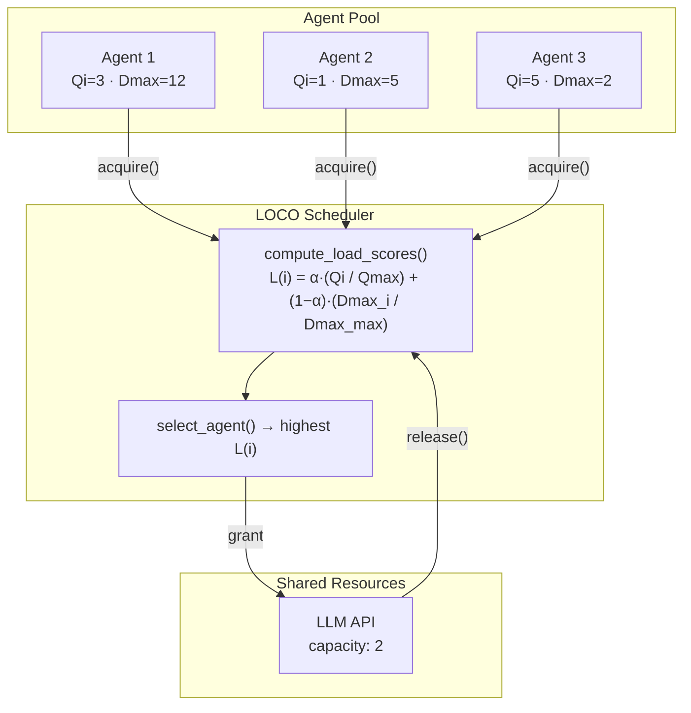

## Thesis → Agent Mapping

The scheduler is a direct port of the 2011 LOCO-MAC contention resolution protocol. Every MAC primitive has an agent equivalent:

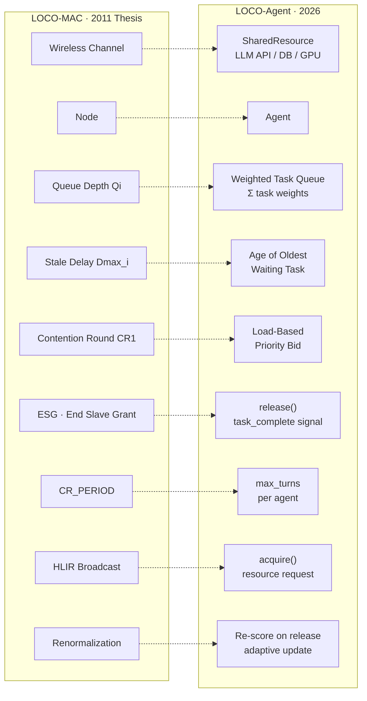

## Summary

| Day | Date | Focus | Risk | Hard Gate |
|-----|------|-------|------|-----------|
| 1 | Mon May 18 | Foundation + Spec | Low | `git log` shows ≥2 commits; SPEC.md defines public API |
| 2 | Tue May 19 | Package scaffolding + Task/Agent | Low | `pip install -e ".[dev]"` works; Task/Agent tests pass |
| 3 | Wed May 20 | Scheduler scoring core | Low | `compute_load_scores()` + `select_agent()` pass ≥10 unit tests |
| 4 | Thu May 21 | Async resource + event loop | **High** | Async acquire/release cycle works; priority ordering holds |
| 5 | Fri May 22 | Async scheduler integration | **High** | 5 agents, 1 resource, no deadlock; cancellation cleans up |
| 6 | Sat May 23 | α API + adaptive tuning (stretch) | Medium | Scenario 1 (burst) replay within 5% of notebook |
| 7 | Sun May 24 | Full scenario validation | Medium | All 4 scenarios pass within tolerance (incl. MDASH security) |
| 8 | Mon May 25 | Adapter layer | Low | Vanilla adapter runs end-to-end |
| 9 | Tue May 26 | Observability + testing utils | Low | Scheduling produces parseable JSON log; `loco/testing.py` works |
| 10 | Wed May 27 | Examples + sandbox + docs | Low | `sandbox.py --help` works; README renders correctly |
| 11 | Thu May 28 | Release | Low | CI green; `gh release view v0.1.0` works |

> **Timeline:** May 18 – May 28 (11 straight days, no breaks). Ship in under two weeks.
> If time pressure hits, **renormalization (Day 6) is the first thing to cut** — defer to v0.2.
> Days 8-9 (adapter + observability) can also compress to 1 day if needed.

---

## Day 1 — Foundation + Spec

> **What we're doing today:** We're laying the ground that everything else stands on — a version-controlled repo, a license that protects us, and a spec that defines what LOCO-Agent's public API looks like. Without this, every subsequent day is building on sand. The spec forces us to make naming and interface decisions *before* writing code, which is cheaper than discovering them mid-build. By end of day we should be able to hand someone the SPEC.md and they understand exactly what LOCO-Agent does and doesn't do.

| Item | Detail |
|------|--------|
| `git init` | Initialize repo, first commit |
| `.gitignore` | Python defaults: `__pycache__/`, `.ipynb_checkpoints/`, `dist/`, `.eggs/`, `*.egg-info/`, `.venv/`, `.env` |
| `LICENSE` | AGPL-3.0 full text |
| `SPEC.md` | v0.1 public API specification (see below) |
| Notebook review | Scan `simulation/loco_simulation.ipynb` for uncaptured edge cases or TODOs |

### SPEC.md must contain

- Constructor signatures: `Task`, `Agent`, `SharedResource`, `LOCOScheduler`
- `optimize_for` enum: `"latency"` / `"balanced"` / `"throughput"`
- Async public API: `acquire()`, `release()`, `submit_task()`, `run()`
- Internal sync API: `compute_load_scores()`, `select_agent()`, `_step()`
- Abstract adapter interface: `BaseAdapter` method signatures
- Explicit in-scope / out-of-scope boundary for v0.1

### Completion gate

```bash
git log --oneline                # ≥2 commits (LICENSE, SPEC)
cat SPEC.md | head -5            # contains "LOCO-Agent v0.1 API Specification"
test -f LICENSE                  # AGPL exists
```

### Risks

| Risk | Likelihood | Impact | Mitigation |
|------|-----------|--------|------------|
| Scope creep in spec | Medium | Delays Day 2 | Timebox to 1 day. Unresolved questions get a `TBD` tag, not a design session |
| Wrong API shape discovered later | Low | Rework Days 4-5 | Spec is a target, not a contract. Expect 1-2 signature changes during build |

---

## Day 2 — Package Scaffolding + Task/Agent Extraction

> **What we're doing today:** We're turning the validated notebook into a real Python package that anyone can `pip install`. The Task and Agent classes are the atoms of the system — every scheduling decision starts with "how many tasks does this agent have, and how long has the oldest one been waiting?" Getting these right, typed, and tested means the scheduler on Day 3 has a solid foundation to build on. This is also the day the project starts to *feel* like a real library, not a research notebook.

| Item | Detail |
|------|--------|
| Package layout | `loco/__init__.py`, `loco/task.py`, `loco/agent.py`, `loco/adapters/base.py` |
| `pyproject.toml` | Python ≥3.10, dev deps: `pytest`, `pytest-asyncio`, `ruff` |
| `Task` class | Extract from notebook → typed dataclass. Fields: `task_id`, `weight`, `arrival_tick`, `age`, `task_type` |
| `Agent` class | Extract from notebook → typed dataclass. Properties: `queue_depth_weighted`, `dmax`. Method: `serve_oldest_task()` |
| `adapters/base.py` | Abstract `BaseAdapter` with method stubs from SPEC.md |
| Unit tests | `tests/test_task.py`, `tests/test_agent.py` |

### Task tests (minimum)

| Test | Assertion |
|------|-----------|
| Create task with default weight | `weight == 1` |
| Create task with custom weight | `weight == 3` |
| Task age initializes to 0 | `age == 0` |
| Invalid weight rejected | `ValueError` on `weight < 1` |

### Agent tests (minimum)

| Test | Assertion |
|------|-----------|
| Empty agent has `queue_depth_weighted == 0` | Passes |
| Add 3 tasks (weights 1, 2, 3) → `queue_depth_weighted == 6` | Passes |
| `dmax` returns age of oldest task | Passes |
| `serve_oldest_task()` removes and returns the oldest | Passes |
| `serve_oldest_task()` on empty agent | Returns `None` or raises |
| Completed tasks tracked | `len(completed_tasks)` increments |

### Completion gate

```bash
pip install -e ".[dev]"                            # editable install works
python -c "from loco import Task, Agent"           # imports work
pytest tests/test_task.py tests/test_agent.py -v   # all pass
```

### Risks

| Risk | Likelihood | Impact | Mitigation |
|------|-----------|--------|------------|
| Naming decisions slow extraction | Low | Hours, not days | Follow notebook naming unless SPEC says otherwise |
| `serve_oldest_task()` semantics unclear for weighted tasks | Low | Affects Day 3 | Oldest by arrival tick, not by weight. Lock this in SPEC |

---

## Day 3 — Scheduler Scoring Core

> **What we're doing today:** We're building the brain of the system — the load function that decides which agent gets the resource next. This is the direct port of the thesis's contention resolution algorithm, and it's the core differentiator against every incumbent. LangGraph routes by graph edges, CrewAI routes by role — LOCO-Agent routes by load score. After today, we have a working scheduler that can prove "the agent with the most urgent work gets served first" in a way none of the incumbents can claim.

| Item | Detail |
|------|--------|
| `loco/scheduler.py` | `LOCOScheduler` class with sync scoring internals |
| `compute_load_scores()` | `L(i) = α × (Qi / max{Qj}) + (1-α) × (Dmax_i / max{Dmax_j})` → `dict[str, float]` |
| `select_agent(scores)` | Highest score wins; random tie-break with optional seed |
| `_step(arrivals)` | Internal: accept arrivals → score → select → serve → age remaining. Used by tests and scenario replay |
| `loco/metrics.py` | `jains_fairness(values)` utility |
| `total_tasks_remaining()` | Count unserved tasks across all agents |
| `mean_wait_time(agent_id)` | Average age of completed tasks for given agent |
| History tracking | `scheduler.history` list with per-step records. **Capped at `max_history=10_000` by default** — ring buffer drops oldest entries. Prevents memory growth in long-running schedulers. |

### Scoring pipeline

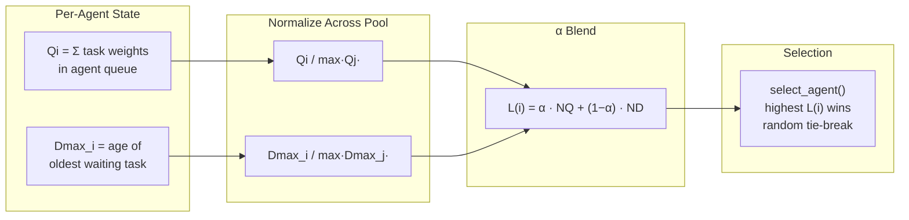

> **α controls the tradeoff:** α=0 → prioritize agents whose tasks have waited longest (latency). α=1 → prioritize agents with the deepest backlog (throughput). α=0.25 → recommended balanced default.

### Unit tests (minimum 10)

| # | Test | Assertion |
|---|------|-----------|
| 1 | Single agent, no contention | That agent is always selected |
| 2 | All agents empty | `select_agent()` returns `None` |
| 3 | Equal load, all agents | Tie-break is random (run 100x, check distribution) |
| 4 | α=0: agent with highest Dmax wins | Correct agent selected |
| 5 | α=1: agent with deepest queue wins | Correct agent selected |
| 6 | α=0.25: mixed priority | Score ordering matches hand-calculated values |
| 7 | Task weights affect `queue_depth_weighted` | Heavier tasks → higher score at α=1 |
| 8 | `_step()` with no arrivals | No crash, ages existing tasks |
| 9 | `_step()` serves one task per call | `total_tasks_remaining` decrements by 1 |
| 10 | Jain's fairness = 1.0 for equal values | Exact equality |
| 11 | Jain's fairness < 1.0 for skewed values | Returns expected range |

### Completion gate

```bash
python -c "from loco import LOCOScheduler"
pytest tests/test_scheduler.py -v   # ≥10 tests, all pass
```

### Risks

| Risk | Likelihood | Impact | Mitigation |
|------|-----------|--------|------------|
| Division by zero when `max{Qj} == 0` or `max{Dmax_j} == 0` | Medium | Runtime crash | Handle in `compute_load_scores()` — if denominator is 0, use 1.0 (matches notebook `or 1.0` pattern) |
| History ring buffer edge cases | Low | Lost records at boundary | Test: verify oldest entries are dropped when `max_history` is exceeded |
| `_step()` return type unclear | Low | API confusion | Return a `StepResult` dataclass: `selected_agent`, `served_task`, `scores` |

---

## Day 4 — Async Resource + Event Loop

> **What we're doing today:** We're crossing from "algorithm that works in simulation" to "infrastructure that works in production." The notebook picks who goes next, but production systems need to actually *manage access* — agents waiting, agents holding, agents releasing. Today we build the SharedResource and the async acquire/release mechanism. This is where LOCO-Agent stops being a research project and starts being the scheduling layer that Levie's token-budget vision needs underneath it. It's also the riskiest day — the notebook has no resource concept, so everything here is new design.

> **This is the first of two high-risk days. The notebook has no resource concept. Everything here is new design.**

| Item | Detail |
|------|--------|
| `loco/resource.py` | `SharedResource` class |
| Capacity model | `capacity: int` — how many agents can hold the resource simultaneously |
| Async acquire | `async acquire(agent_id)` — blocks (via `asyncio.Condition`) until a slot opens; respects priority order |
| Release | `release(agent_id)` — frees slot, wakes highest-priority waiter based on current load scores |
| Priority wait queue | Pending acquire requests ordered by `compute_load_scores()` at grant time, not request time (scores may change while waiting) |
| Utilization tracking | `utilization() → float` (current holders / capacity) |
| Context manager | `async with resource.acquire(agent_id): ...` — release on exit, including exceptions |

### Key design decisions

| Decision | Choice | Why |
|----------|--------|-----|
| Score at request time or grant time? | **Grant time** | Scores change as other agents complete work. Stale scores cause priority inversion |
| What if selected agent's task was cancelled? | Skip, re-score, grant to next | Clean removal from wait queue |
| Can an agent hold multiple resources? | Yes, but acquire is per-resource | Multi-resource deadlock is out of scope for v0.1 — document the limitation |

### Contention resolution flow

This is the async equivalent of the thesis's contention round (CR1). When multiple agents compete for a resource, the scheduler scores them at **grant time** — not request time — because Dmax and queue depth change while agents wait.

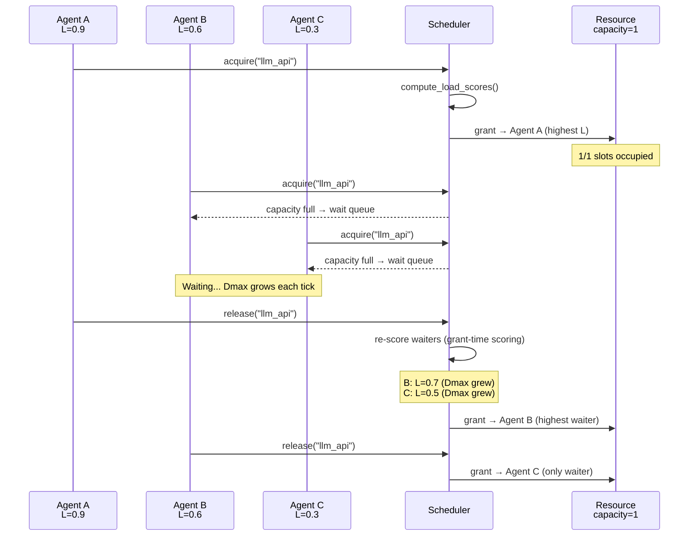

> **Key insight from the thesis:** The Dmax term is not a tie-breaker — it is the primary fairness mechanism. Agents that wait longer see their priority rise naturally, preventing starvation without explicit rules.

### Tests

| Test | Assertion |
|------|-----------|
| Acquire with capacity=1, one agent | Acquires immediately |
| Acquire with capacity=1, two agents | Second blocks until first releases |
| Priority ordering: high-load agent gets resource first | Agent with higher load score acquires before lower |
| Release wakes exactly one waiter | Not all waiters |
| Context manager releases on normal exit | Slot freed |
| Context manager releases on exception | Slot freed |
| `utilization()` reflects current holders | 0.0 → 1.0 → 0.0 lifecycle |

### Completion gate

```bash
pytest tests/test_resource.py -v   # all async resource tests pass
pytest tests/ -v                   # no regressions in Days 2-3 tests
```

### Risks

| Risk | Likelihood | Impact | Mitigation |
|------|-----------|--------|------------|
| Priority inversion under `asyncio.Condition` | Medium | Wrong agent gets resource | Re-score all waiters on every release, don't rely on FIFO order |
| Deadlock if release never called | Medium | Scheduler hangs | Context manager is mandatory in public API; raw acquire/release is internal |
| Race between score recomputation and grant | Medium | Subtle ordering bugs | Hold a lock during score→grant sequence; release lock after grant |
| Scope creep into multi-resource scheduling | Low | Day 5 blocked | Explicitly scope to single-resource contention for v0.1 |

---

## Day 5 — Async Scheduler Integration

> **What we're doing today:** Yesterday we built the resource lock. Today we wire it into a complete system — submit a task, the scheduler queues it, scores it against competing agents, acquires the resource, runs the work, releases, and repeats. This is the full lifecycle that Armstrong's "fleet of agents" would run through. We're also adding the safety mechanisms production needs: backpressure so the system doesn't drown under load, cancellation so stuck agents don't block everyone, and error handling so a crash in one agent doesn't take down the fleet. After today, LOCO-Agent is a working async scheduler end-to-end.

> **Second high-risk day. This connects the scoring core to the async resource layer into a working system.**

| Item | Detail |
|------|--------|
| `LOCOScheduler.run()` | `async run()` — main entry point. Accepts tasks, manages lifecycle |
| `submit_task(agent_id, task)` | Enqueue a task to an agent; triggers re-scoring if agent is waiting |
| Backpressure | Configurable `max_waiters` per resource. If exceeded, `acquire()` raises `BackpressureError` (checked at acquire time, not submit time) |
| Cancellation | `asyncio.timeout()` on acquire. On timeout, agent is cleanly removed from wait queue |
| Error handling | If agent crashes while holding resource → auto-release via context manager + error callback |
| Lifecycle events | `on_task_started(agent_id, task)`, `on_task_completed(agent_id, task, result)` — hooks for observability (Day 9) |
| `shutdown(timeout)` | `async shutdown(timeout: float = 30.0)` — graceful shutdown: stop accepting new tasks (`ShutdownError`), wait for in-flight to complete, cancel remaining waiters, return `ShutdownResult` (completed, cancelled, timed_out counts) |
| Logical tick on release | Each `release()` increments a global tick counter. All waiting tasks' `age` increments by 1 per tick. This is the async equivalent of the notebook's `step()` aging. |

### Full task lifecycle

This diagram shows the complete path of a task through the async scheduler — from submission to completion, including backpressure, cancellation, and error handling.

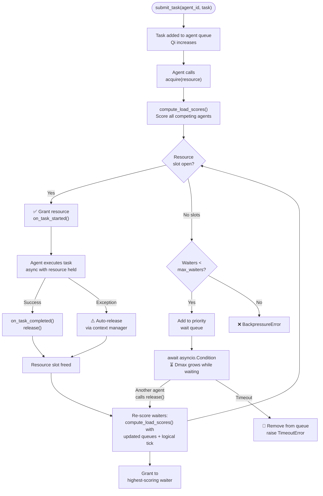

> **Thesis parallel:** The `release() → re-score → grant` cycle is the direct equivalent of the ESG (End Slave Grant) signal in LOCO-MAC. The master node immediately reassigns the channel — no idle gap.

### Integration test scenario

> 5 agents, 1 resource with capacity=2. Each agent has 3 tasks. All 15 tasks complete without deadlock or timeout.

| Test | Assertion |
|------|-----------|
| 5 agents, capacity=2, 15 tasks | All complete; no deadlock |
| Cancellation: agent times out at 0.1s | Removed from queue; other agents unaffected |
| Agent raises exception mid-task | Resource released; other agents proceed |
| `BackpressureError` when `max_waiters` exceeded | Raised at `acquire()` time; scheduler continues |
| Submit task to unknown agent | `ValueError` |
| Lifecycle hooks fire in correct order | `started` before `completed` for each task |
| Logical tick: release increments global tick | `task.age` of all waiting tasks increments by 1 on each release |
| `shutdown(timeout=1.0)` with in-flight task | In-flight completes; waiters cancelled; `ShutdownResult` accurate |
| `shutdown()` then `submit_task()` | Raises `ShutdownError` |
| `shutdown(timeout=0)` force-cancels everything | All tasks cancelled; resource released |

### Completion gate

```bash
pytest tests/test_integration.py -v    # all pass, no hangs (timeout=30s on test suite)
pytest tests/ -v                       # full suite green
```

### Risks

| Risk | Likelihood | Impact | Mitigation |
|------|-----------|--------|------------|
| Deadlock in integration test | Medium | Day blocked | Add `asyncio.timeout(10)` wrapper around entire test; fail loud, not silent |
| Backpressure design wrong | Medium | API rework | Start simple: reject on overflow. Queuing strategies are v0.2 |
| Lifecycle hooks add complexity | Low | Delays Day 9 | Hooks are fire-and-forget; no awaiting hook results |
| Test flakiness from timing | Medium | CI unreliable | Use `asyncio.Event` for synchronization in tests, not `asyncio.sleep` |

---

## Day 6 — Renormalization + α API

> **What we're doing today:** We're making the scheduler adaptive and user-friendly. The α parameter is the single knob that controls whether LOCO-Agent optimizes for latency or throughput — but exposing raw α to users is a mistake. Today we wrap it in `optimize_for="balanced"` so a platform engineer doesn't need to understand the thesis to use it. Renormalization makes the scheduler self-adjusting: as agents complete work and the load landscape shifts, the scoring denominators update automatically. This is what Levie described as "tokens flowing to highest-value work" — the system adapts in real time without manual tuning.

> **Note: This day splits into two parts. The `optimize_for` API is essential. Adaptive α tuning is the cuttable stretch goal.**
>
> - **Score recomputation** (re-running `compute_load_scores()` with fresh denominators on every release) is already built into Day 5's release path. That is NOT what this day adds.
> - **Adaptive α tuning** (adjusting α based on observed wait time variance) IS the new algorithm work. This is what gets cut if the schedule slips.

| Item | Detail |
|------|--------|
| `optimize_for` API | `LOCOScheduler(agents, optimize_for="balanced")` maps to α internally |
| α mapping | `"latency"` → 0.0, `"balanced"` → 0.25, `"throughput"` → 0.5. Note: `"throughput"` intentionally caps at 0.5, not 1.0, because α=1.0 causes the fairness inversion from Scenario 2 (high-load agents paradoxically wait longer). Document this prominently. |
| Raw α | `LOCOScheduler(agents, alpha=0.3)` for advanced users. Validated: `0.0 <= alpha <= 1.0`, else `ValueError`. |
| Validation | Passing both `optimize_for` and `alpha` raises `ValueError` |
| **Stretch: Adaptive α** | Experimental: nudge α based on observed wait time variance. **This is the first thing to cut.** Ship static α mapping without it. |
| Scenario 1 replay | Burst scenario against real async scheduler; validate service order |

### Tests

| Test | Assertion |
|------|-----------|
| `optimize_for="latency"` → internal α=0.0 | Passes |
| `optimize_for="throughput"` → internal α=0.5 | Passes |
| Both `optimize_for` and `alpha` → `ValueError` | Raises |
| Neither → default `"balanced"` (α=0.25) | Passes |
| `alpha=1.5` or `alpha=-0.1` → `ValueError` | Raises |
| Scenario 1 burst replay | Service counts within 5% of notebook |

### Completion gate

```bash
pytest tests/test_alpha_api.py -v        # α mapping + validation pass
pytest tests/test_scenario1.py -v         # burst replay within 5%
```

### Risks

| Risk | Likelihood | Impact | Mitigation |
|------|-----------|--------|------------|
| Renormalization changes scheduling order | Medium | Scenario replay fails | Compare with and without renorm. If divergence > 5%, ship without renorm |
| Adaptive α nudge rabbit hole | High | Eats entire day | **Do not attempt adaptive α in v0.1.** Static mapping only |
| Scenario 1 replay tolerance too tight | Low | False failure | Use 5% tolerance, not exact match. Async introduces non-determinism in tie-breaking |

---

## Day 7 — Full Scenario Validation

> **What we're doing today:** This is the day we earn the right to say "proven convergence." The simulation notebook validated the algorithm in theory — today we prove the production code matches. Four scenarios, four sets of hard assertions, run against the real async scheduler with logical ticks. If burst priority ordering holds, if no agent starves under sustained load, if webhook urgency escalates naturally through Dmax, and if multi-model cost routing works for security-style workloads — then LOCO-Agent's central claim is backed by evidence, not just math. This is the day that separates us from every framework that says "trust us, it works."

> **This is the quality gate. Nothing ships if these scenarios don't pass.**

| Item | Detail |
|------|--------|
| Scenario 1 — Burst | 8 agents, agent i gets (i+1) tasks at tick 0. Service counts match notebook |
| Scenario 2 — Fairness | 10 agents, 500 logical ticks, sustained load. Jain's ≥ 0.98 at α=0. No starvation at any α |
| Scenario 3 — Webhook spike | 10 background + 5 webhook agents. Spike at tick 30. Webhook response at α=0 ≤ 45 ticks. Dmax crossover visible |
| **Scenario 4 — MDASH security** | Multi-model cost routing: 20 auditor agents (weight=3, SOTA model), 30 debater agents (weight=1, distilled model), 5 prover agents (weight=5, SOTA model). Single SOTA resource capacity=3. Provers with high Dmax should escalate above auditors. Validates weighted queue depth with realistic model-cost weights. |
| All 4 run async | Using real `acquire()`/`release()` with simulated work (no actual LLM calls). Logical ticks (age increments on release). |
| Tolerance bounds | Each assertion has explicit ±% tolerance documented |

### Scenario layouts

**Scenario 1 — Burst:** All agents receive work simultaneously. Tests whether the load function correctly prioritizes high-backlog agents.

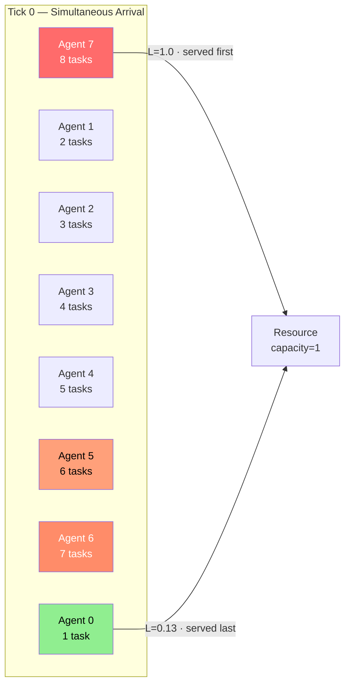

**Scenario 2 — Fairness under sustained load:** Two groups generate work at different rates for 500 ticks. Tests starvation resistance and α sensitivity.

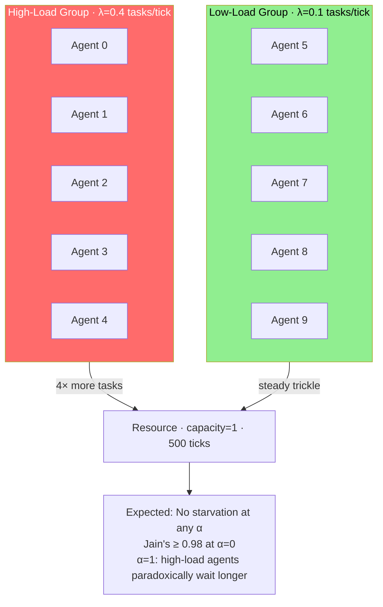

**Scenario 3 — Webhook spike:** Background agents at ~70% utilization, then urgent webhook agents arrive. Tests whether Dmax naturally escalates urgent tasks without hardcoded priority rules.

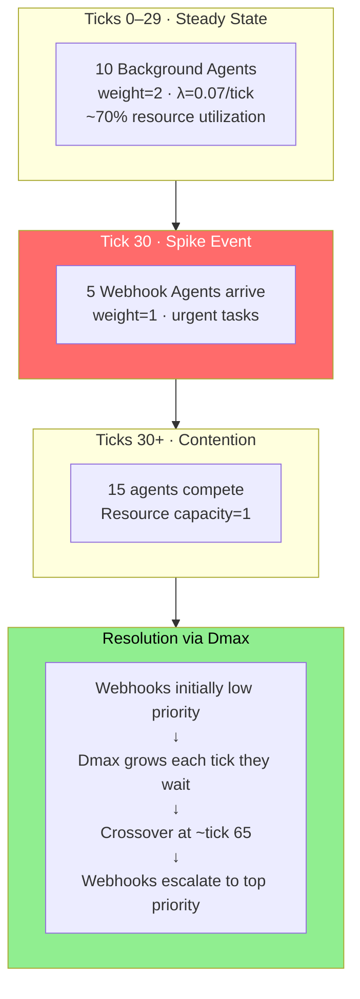

### Assertions per scenario

| Scenario | Metric | Notebook value | Tolerance |
|----------|--------|---------------|-----------|
| 1 — Burst | Service count per agent | Exact match to task assignment | ±0 (deterministic — counting invariant) |
| 1 — Burst | High-queue agents served first in early ticks | Order preserved | **±1 position** (async tie-breaking may swap near-equal scores) |
| 2 — Fairness | Jain's index at α=0 | 0.995 | ≥ 0.98 |
| 2 — Fairness | No agent starves | 0 agents with 0 service | Exact |
| 2 — Fairness | α=1 wait-time inversion exists | High-load agents wait longer | Directional check |
| 3 — Webhook spike | Webhook completion at α=0 | ~33 ticks | ≤ 45 ticks |
| 3 — Webhook spike | Webhook completion at α=1 | ~105 ticks | ≤ 130 ticks |
| 3 — Webhook spike | Dmax crossover | Visible around tick 65 | Between tick 50-80 |
| 4 — MDASH security | Provers (weight=5, high Dmax) escalate above auditors (weight=3) | Provers served within 20 ticks of submission | ≤ 25 ticks |
| 4 — MDASH security | Debaters (weight=1) don't starve under heavy auditor load | All debaters eventually served | No agent with 0 service |
| 4 — MDASH security | SOTA resource (capacity=3) fully utilized during contention | Utilization ≥ 0.9 during peak | ≥ 0.85 |

### Completion gate

```bash
pytest tests/test_scenarios.py -v   # all 4 pass within tolerance
```

### Risks

| Risk | Likelihood | Impact | Mitigation |
|------|-----------|--------|------------|
| Logical tick dynamics differ from notebook's sync ticks | Medium | Scenario tolerances don't hold | Tolerances already relaxed (order ±1, wider tick bounds). Revalidate incrementally during Days 4-6. |
| Days 4-5 changed scheduling behavior | Medium | Divergence from notebook | Run scenarios incrementally during Days 4-6, not just Day 7 |
| Scenario 4 (MDASH) has no notebook baseline | Low | No reference numbers to compare | Validate directional behavior (provers escalate, debaters don't starve) not exact numbers |

---

## Day 8 — Adapter Layer

> **What we're doing today:** We're building the integration surface that makes LOCO-Agent framework-agnostic. The whole strategic position — "we're not another framework, we're the scheduling layer underneath all frameworks" — depends on agents from any framework being able to register with the scheduler. Today we define that contract (BaseAdapter) and implement the first reference adapter for plain Python. This is the foundation that LangGraph, CrewAI, and OpenAI SDK adapters will build on. After today, a developer can take any async Python function, register it as an agent, and have LOCO-Agent schedule it.

| Item | Detail |
|------|--------|
| `adapters/base.py` | Finalize abstract interface |
| `adapters/vanilla.py` | Reference implementation — wraps plain Python async callables as agent handlers |
| Registration | `adapter.register_agent(agent_id, handler)` → creates `Agent`, registers with scheduler |
| Task submission | `adapter.submit_task(agent_id, task)` → enqueues task |
| Lifecycle | `adapter.on_scheduled(agent_id, task)` → calls handler; `adapter.on_completed(agent_id, task, result)` → fires callback |
| Example | `examples/vanilla_example.py` — 3 async functions as agents, tasks submitted, scheduler runs them |

### Adapter interface

```python
class BaseAdapter(ABC):
    @abstractmethod
    async def register_agent(self, agent_id: str, handler: Callable) -> Agent: ...

    @abstractmethod
    async def submit_task(self, agent_id: str, task: Task) -> None: ...

    @abstractmethod
    async def on_scheduled(self, agent_id: str, task: Task) -> Any: ...

    @abstractmethod
    async def on_completed(self, agent_id: str, task: Task, result: Any) -> None: ...
```

### Adapter architecture

The adapter layer decouples framework-specific agent implementations from the LOCO scheduling core. v0.1 ships with the Vanilla adapter only; framework adapters are v0.2.

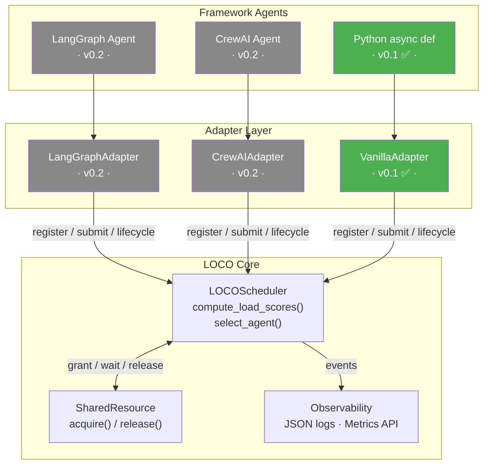

> **Design principle:** The adapter translates framework-specific agent interfaces (LangGraph's graph nodes, CrewAI's role-based crews) into LOCO's `register_agent` / `submit_task` / `on_scheduled` / `on_completed` lifecycle. The scheduler never knows which framework produced the agent.

### Tests

| Test | Assertion |
|------|-----------|
| Register agent via vanilla adapter | Agent exists in scheduler |
| Submit task via adapter | Task appears in agent queue |
| Full lifecycle: register → submit → schedule → complete | Handler called, result returned |
| Register duplicate agent ID | `ValueError` |
| Submit to unregistered agent | `ValueError` |

### Completion gate

```bash
pytest tests/test_adapter_vanilla.py -v   # lifecycle tests pass
python examples/vanilla_example.py         # runs, prints scheduling decisions
```

### Risks

| Risk | Likelihood | Impact | Mitigation |
|------|-----------|--------|------------|
| Interface doesn't fit LangGraph/CrewAI patterns | Medium | Rework in v0.2 | Acceptable — vanilla is the v0.1 target. Interface evolves |
| Handler calling convention unclear (sync vs async) | Low | API confusion | Handlers are `async def` only in v0.1. Sync wrappers are v0.2 |

---

## Day 9 — Observability

> **What we're doing today:** We're building the audit trail that Hoffman says regulated industries need. Every scheduling decision — who got the resource, at what priority, with what queue depth — becomes a structured JSON record. This isn't just debugging output; in a compliance context (AML, KYC), this log is evidence that the system allocated compute fairly and predictably. The metrics API on top gives platform engineers the visibility Levie described: "where are my tokens going, and is high-value work actually getting served first?" After today, LOCO-Agent can answer that question with data.

| Item | Detail |
|------|--------|
| `loco/logging.py` | Structured JSON scheduling log via Python `logging` module |
| Per-event record | `{"tick": 42, "event": "grant", "agent": "agent_3", "score": 0.87, "queue_depth": 5, "dmax": 12, "resource": "llm_api", "utilization": 0.75, "task_cost": 3.0, "agent_cumulative_cost": 47.5}` |
| Event types | `grant`, `release`, `enqueue`, `timeout`, `error` |
| **Cost tracking** | Per-agent cost accumulator: `scheduler.metrics.cost_by_agent()` returns `dict[str, float]`. Per-task cost recorded in scheduling log. Total spend: `scheduler.metrics.total_cost()`. **No enforcement in v0.1** -- visibility only. Cost ceilings are enterprise tier. |
| Metrics API | `scheduler.metrics.wait_time_by_agent()`, `scheduler.metrics.resource_utilization()`, `scheduler.metrics.priority_distribution()`, `scheduler.metrics.cost_by_agent()`, `scheduler.metrics.total_cost()` |
| Constructor flag | `LOCOScheduler(..., enable_logging=True)` |
| Hooks integration | Connects to Day 5 lifecycle events (`on_task_started`, `on_task_completed`) |
| `loco/testing.py` | Developer testing utilities (see below) |

### Developer testing utilities (`loco/testing.py`)

The goal: a developer integrating LOCO-Agent should be able to write their first test in under 10 lines, with no boilerplate.

```python
# loco/testing.py — public API for users testing their own agents

# 1. Mock factories — instant setup, no real I/O
mock_resource(name, capacity=1)        # Resource that completes instantly
mock_agent(agent_id, pending_tasks=0, task_weight=1)  # Pre-loaded agent

# 2. Sync test scheduler — no async needed in user test suites
class SyncTestScheduler:
    """Wraps LOCOScheduler with synchronous step() for deterministic testing."""
    def __init__(self, agents, alpha=0.25, seed=42): ...
    def add_tasks(self, agent_id, tasks): ...
    def step(self) -> StepResult: ...       # One tick, fully deterministic
    def run_all(self) -> RunResult: ...     # Run until no tasks remain

# 3. Scenario replay — declarative scenario definition + assertions
class Scenario:
    """Define a workload scenario and replay it with assertions."""
    def __init__(self, agents, resource, ticks, alpha=0.25, seed=42): ...
    async def run(self) -> ScenarioResult: ...

class ScenarioResult:
    def agent(self, agent_id) -> AgentResult: ...  # per-agent metrics
    @property
    def jains_fairness(self) -> float: ...
    @property
    def total_wait_time(self) -> float: ...
    @property
    def scheduling_log(self) -> list[dict]: ...
```

**Example: user writing their first test**

```python
from loco.testing import SyncTestScheduler, mock_agent, mock_resource

def test_my_agent_gets_priority_when_backlogged():
    agents = [mock_agent("mine", pending_tasks=10), mock_agent("other", pending_tasks=2)]
    scheduler = SyncTestScheduler(agents, alpha=0.5, seed=42)
    result = scheduler.step()
    assert result.selected_agent == "mine"  # higher queue depth → higher priority
```

**Example: async scenario replay**

```python
from loco.testing import Scenario
import pytest

@pytest.mark.asyncio
async def test_webhooks_served_within_45_ticks():
    scenario = Scenario(
        agents={"bg": {"count": 10, "rate": 0.07, "weight": 2},
                "webhook": {"count": 5, "spike_at": 30, "weight": 1}},
        resource={"capacity": 1},
        ticks=250, alpha=0.25,
    )
    result = await scenario.run()
    for i in range(5):
        assert result.agent(f"webhook_{i}").wait_time <= 45
    assert result.jains_fairness >= 0.98
```

### Event flow

Every scheduling decision emits a structured event. This is the audit trail — in regulated environments (AML, compliance), these records are evidence.

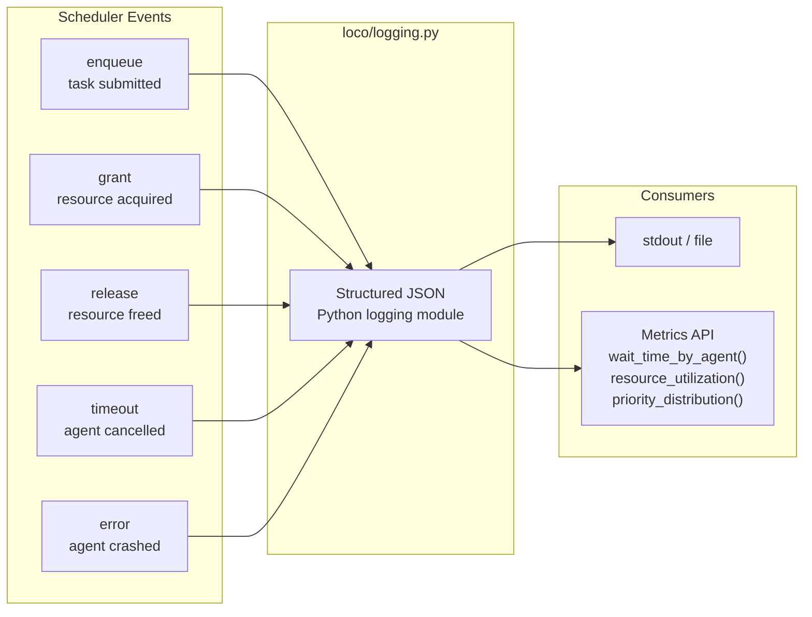

```json
{"tick": 42, "event": "grant", "agent": "agent_3", "score": 0.87,
 "queue_depth": 5, "dmax": 12, "resource": "llm_api", "utilization": 0.75}
```

### Tests

| Test | Assertion |
|------|-----------|
| Logging enabled → events emitted | JSON lines parseable |
| Logging disabled → no output | Silent |
| `wait_time_by_agent()` returns correct values | Matches manual calculation |
| `resource_utilization()` over time | 0.0 when idle, approaches 1.0 under load |
| All event types present in a full run | `grant`, `release`, `enqueue` all appear |
| `mock_resource()` completes instantly | No blocking |
| `mock_agent()` pre-loads N tasks | `queue_depth_weighted` matches |
| `SyncTestScheduler.step()` is deterministic with seed | Same seed → same result across runs |
| `SyncTestScheduler.run_all()` drains all tasks | `total_tasks_remaining == 0` |
| `Scenario.run()` produces `ScenarioResult` with metrics | `jains_fairness`, per-agent wait times accessible |

### Completion gate

```bash
pytest tests/test_logging.py -v    # all pass
pytest tests/test_testing.py -v    # testing utilities pass
python -c "
import asyncio, json
from loco import LOCOScheduler, Agent, Task, SharedResource
# ... run a few tasks with logging
"  # produces valid JSON lines
python -c "
from loco.testing import SyncTestScheduler, mock_agent
agents = [mock_agent('a', pending_tasks=5), mock_agent('b', pending_tasks=2)]
s = SyncTestScheduler(agents, seed=42)
r = s.step()
print(f'Selected: {r.selected_agent}')
"  # prints 'Selected: a'
```

### Risks

| Risk | Likelihood | Impact | Mitigation |
|------|-----------|--------|------------|
| Log schema changes during build | Low | Consumer code breaks | Schema is internal for v0.1. Document as unstable |
| Logging adds latency to hot path | Low | Performance regression | Fire-and-forget; no `await` in log emission |
| SyncTestScheduler diverges from async scheduler | Medium | Users get different results in tests vs. production | Both call the same `compute_load_scores()` / `select_agent()` core. Sync wraps `_step()` directly |

---

## Day 10 — Examples + Sandbox + Documentation

> **What we're doing today:** We're making LOCO-Agent accessible to someone who has never heard of it. The best scheduling algorithm in the world is useless if a developer can't run it in 5 minutes. The sandbox CLI lets someone type one command and *see* contention resolution happening — tick by tick, agents competing, priorities shifting. The examples replicate the three validated scenarios as copy-paste-runnable scripts. The README tells the story: what this is, why it exists, and how to use it. After today, the GitHub repo is ready for its first visitor.

| Item | Detail |
|------|--------|
| `examples/burst.py` | Scenario 1 as runnable async script |
| `examples/fairness.py` | Scenario 2 as runnable async script |
| `examples/webhook_spike.py` | Scenario 3 as runnable async script |
| `examples/mdash_security.py` | Scenario 4 as runnable async script (auditors + debaters + provers) |
| `sandbox.py` | CLI: `python sandbox.py --agents 10 --alpha 0.25 --scenario webhook_spike` |
| Sandbox output | Tick-by-tick log sorted by **logical tick** (not wall-clock completion order) showing scheduling decisions, escalation, final summary metrics |
| `README.md` | **Pain-first positioning** (see structure below), quick start, α tuning guide, link to simulation notebook |
| `blog/launch-post.md` | Launch blog post draft assembled from daily retros and tweets (see below) |
| Docstrings | All public API methods |

### README structure — pain-first positioning

Lead with the problem, not the solution. The target reader is a platform engineer who just got paged because agents collided on a rate limit.

```markdown
# LOCO-Agent

**Your 50 agents just collided on the same API. The urgent one is stuck behind a batch job. Nobody knows why.**

LOCO-Agent is a load-aware scheduling layer for multi-agent systems. It sits underneath
LangGraph, CrewAI, OpenAI SDK, or any Python agent framework and decides which agent
gets the shared resource next — based on queue depth, wait time, and task cost.

- Agents with urgent work escalate automatically (no priority rules needed)
- Proven convergence from a 2011 wireless networks thesis, rebuilt for AI agent fleets
- One equation: L(i) = α·(queue_depth) + (1-α)·(wait_time)
- Framework-agnostic: register any async function as an agent

## Quick start (< 2 minutes)
[pip install + 5 lines]

## Why this exists
[Levie token budgets + Armstrong fleet management + the gap no framework fills]

## Try it
[sandbox CLI command]
```

### Launch blog post draft

Assembled from the 11 daily retros and tweets. Structure:

```markdown
# We solved this in wireless networks in 2011. Here's what happened when we applied it to AI agent fleets.

## The problem nobody's naming
[Rate limit collisions, priority inversion, unexplained latency spikes]

## The thesis connection
[LOCO-MAC → LOCO-Agent mapping, 2011 origin]

## The load function
[One equation, α tuning, simulation results]

## From simulation to production
[Async-first, 4 validated scenarios including MDASH-style security]

## What Microsoft's MDASH confirms
[100+ agents, no scheduling layer, "the model is one input"]

## Try it yourself
[sandbox command, GitHub link, good-first-issues]
```

> **Note:** The blog post is the anchor content for the Day 11 launch tweet. Without it, the tweet points to a README. With it, it points to a story. If Day 10 is time-compressed, the blog post is the first thing to push to post-launch (not the README or examples).

### Sandbox CLI interface

```
usage: sandbox.py [-h] --agents N --scenario {burst,fairness,webhook_spike,mdash_security}
                  [--alpha FLOAT] [--optimize-for {latency,balanced,throughput}]
                  [--ticks N] [--capacity N] [--seed INT]
```

### Completion gate

```bash
python examples/burst.py                                            # runs, prints results
python examples/webhook_spike.py                                    # runs, prints results
python examples/mdash_security.py                                   # runs, prints results
python sandbox.py --help                                            # shows usage
python sandbox.py --agents 5 --scenario burst                      # runs, readable output
python -c "import loco; help(loco.LOCOScheduler)"                  # docstrings render
test -f blog/launch-post.md                                         # blog draft exists
```

### Risks

| Risk | Likelihood | Impact | Mitigation |
|------|-----------|--------|------------|
| Time compression from Days 4-5 overrun | Medium | Docs rushed | Priority order: examples > sandbox > README > blog post. Blog post moves to post-launch first. |
| Async output ordering confuses users | Low | UX issue | Sort sandbox output by logical tick; add "tick N:" prefix to every line |
| Pain-first README oversells v0.1 | Low | Trust erosion | Keep claims specific: "proven convergence in 4 scenarios" not "solves all agent problems" |

---

## Day 11 — Release

> **What we're doing today:** We're shipping. CI ensures the code works on every supported Python version. CONTRIBUTING.md invites the first collaborators. The v0.1.0 tag marks the moment LOCO-Agent goes from "project on a laptop" to "open source infrastructure." This is the artifact that earns the right to have the design-partner conversations — with the platform engineers hitting rate limit collisions, the compliance teams needing auditable scheduling, and the enterprise architects looking for the scheduling layer Levie and Armstrong described. The library is the proof; today we publish it.

| Item | Detail |
|------|--------|
| `CONTRIBUTING.md` | Contributor onboarding guide (see below) |
| `.github/workflows/ci.yml` | pytest on push/PR; Python 3.10, 3.11, 3.12 matrix; ruff lint check |
| GitHub issue templates | Bug report, feature request, adapter request |
| `good first issue` labels | Pre-file 5-10 issues tagged for new contributors (see list below) |
| Tag `v0.1.0` | `git tag -a v0.1.0 -m "Initial release"` |
| Push to GitHub | `github.com/ArielSmoliar/loco-agent` |
| Optional: PyPI | `python -m build && twine upload dist/*` |

### CONTRIBUTING.md — Contributor onboarding

The goal: a new contributor goes from `git clone` to passing tests to opening their first PR in under 15 minutes.

```markdown
# Contributing to LOCO-Agent

## Quick start (< 5 minutes)

git clone https://github.com/ArielSmoliar/loco-agent.git
cd loco-agent
python -m venv .venv && source .venv/bin/activate
pip install -e ".[dev]"
pytest                      # all green? you're ready

## Running a single scenario to see the scheduler in action

python sandbox.py --agents 10 --scenario webhook_spike --alpha 0.25

## Code style
- ruff for linting: `ruff check .`
- Type hints on all public APIs
- Tests required for all new functionality

## How to contribute

### 1. Pick an issue
Look for `good first issue` labels — these are scoped, self-contained, and have clear acceptance criteria.

### 2. Adapter contributions (most impactful)
We need adapters for LangGraph, CrewAI, OpenAI SDK, and more.
Each adapter implements `BaseAdapter` — see `adapters/vanilla.py` as a reference.
Use `loco/testing.py` to validate your adapter works with the scheduler.

### 3. PR process
- Fork → branch → PR against `main`
- CI must pass (pytest + ruff on Python 3.10-3.12)
- Include tests for new functionality
- One feature per PR — keep them small and reviewable

## Architecture overview
[Link to PLAN.md diagrams for context]
```

### Good first issues (pre-filed on Day 11)

These are scoped tasks designed to onboard contributors. Each has clear acceptance criteria.

| Issue | Difficulty | Area | Description |
|-------|-----------|------|-------------|
| LangGraph adapter | Medium | Adapter | Implement `LangGraphAdapter` — register LangGraph graph nodes as LOCO agents |
| CrewAI adapter | Medium | Adapter | Implement `CrewAIAdapter` — register CrewAI crew members as LOCO agents |
| OpenAI SDK adapter | Medium | Adapter | Implement `OpenAIAdapter` — register OpenAI Agents SDK agents |
| Multi-resource support | Hard | Core | Allow agents to acquire multiple resources (handle deadlock prevention) |
| Visualization CLI | Easy | Tooling | Add `--plot` flag to `sandbox.py` that generates PNG charts (matplotlib) |
| Prometheus metrics exporter | Medium | Observability | Export scheduling metrics to Prometheus format |
| Custom scenario loader | Easy | Testing | Load scenario definitions from YAML/JSON files for `sandbox.py` |
| Weighted α auto-tuning | Hard | Core | Adaptive α based on observed wait time variance |
| Docker example | Easy | Docs | Dockerfile + docker-compose for running sandbox in a container |
| Benchmark suite | Medium | Testing | Performance benchmarks: throughput at 100/1k/10k agents |

### Contributor funnel

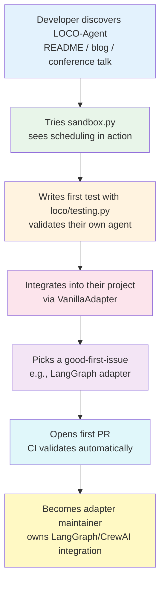

> **The key insight:** `loco/testing.py` is the onramp. A contributor who can write a 10-line test proving their adapter works with the scheduler is 80% of the way to a merged PR. The testing utilities aren't just for users — they're the contributor dev loop.

### CI matrix

```yaml
strategy:
  matrix:
    python-version: ["3.10", "3.11", "3.12"]
```

### Completion gate

```bash
gh release view v0.1.0                    # release exists on GitHub
gh run list --limit 1                      # CI passed
gh issue list --label "good first issue"   # ≥5 issues filed
pip install loco-agent                     # works (if PyPI published)
```

### Risks

| Risk | Likelihood | Impact | Mitigation |
|------|-----------|--------|------------|
| Test fails on Python version not tested locally | Low | Blocks release | Run `pytest` locally on 3.10 before pushing. Most likely issue: `match` statements (3.10+) |
| PyPI name taken | Low | Can't publish | Check `pip index versions loco-agent` before Day 11. Fallback: `loco-scheduler` |
| No contributors show up | Medium | Stalls ecosystem growth | Seed initial community: share in agent-dev Discord/Slack, post on r/LangChain, write launch blog post |
| Good-first-issues too vague | Medium | Contributors abandon PRs | Each issue includes: background context, acceptance criteria, pointer to reference implementation (`vanilla.py`), and which tests to write |

---

## Daily Tweet — Build in Public

Post one tweet per day mapping to what was shipped. The arc tells a story: vision → foundation → core algorithm → production infrastructure → proof → ecosystem → ship.

| Day | Theme | Draft |
|-----|-------|-------|
| Day | Date | Theme | Draft |
|-----|------|-------|-------|
| **0** | Thu May 15 | Vision + market signal | Levie says tokens need to flow to highest-value work. Armstrong says manage fleets of agents. The tooling for that doesn't exist yet. Starting to build it — a scheduling layer that sits underneath LangGraph, CrewAI, and every other framework. Open source, day one. |
| **1** | Mon May 18 | Origin story + MDASH response | **Quote-tweet** [Patrick Moorhead's post](https://x.com/PatrickMoorhead/status/2054685696980553796) with: "Yes — the harness is the moat. But 100+ agents still need a scheduling layer underneath. When 30 auditors want the SOTA model simultaneously, who goes next? That's what we're building with LOCO-Agent: load-aware priority, proven convergence, open source." |
| **2** | Tue May 19 | From notebook to library | Turning a validated Jupyter simulation into a real Python package. Task queues, agent state, type hints, unit tests. The boring work that separates a research idea from something you can `pip install`. |
| **3** | Wed May 20 | The load function | Built the brain of the scheduler today. One equation decides which agent gets the resource next: L(i) = α·(queue_depth) + (1-α)·(wait_time). No rules. No role assignments. Just math. Every incumbent framework routes by convention — LOCO-Agent routes by load. |
| **4** | Thu May 21 | Going async | The hardest day so far. Moving from simulation ticks to a real async event loop. acquire() → score → grant → execute → release → re-score. This is where "research project" becomes "production infrastructure." |
| **5** | Fri May 22 | Backpressure + resilience | What happens when an agent crashes while holding a resource? What if 50 agents are waiting and only 1 slot is open? Built the safety mechanisms today — backpressure, cancellation, auto-release on failure. The stuff you need when managing Armstrong's "fleet of agents." |
| **6** | Sat May 23 | The α knob | One parameter controls whether the scheduler optimizes for latency or throughput. But nobody should have to understand the math to use it. Today: `optimize_for="balanced"`. Three words instead of a thesis chapter. |
| **7** | Sun May 24 | Proving convergence | Ran all three validation scenarios against the production code. Burst recovery, fairness under sustained load, urgent webhook escalation. The scheduler converges — provably. This is the claim no other agent framework can make. |
| **8** | Mon May 25 | Framework-agnostic | Built the adapter layer today. LOCO-Agent doesn't replace LangGraph or CrewAI — it schedules across all of them. Register any async function as an agent. The scheduler doesn't care what framework built it. |
| **9** | Tue May 26 | Audit trail + dev testing | Every scheduling decision is now a structured JSON record. Who got the resource, at what priority, why. Hoffman says regulated industries need governance infrastructure for AI agents — this is it. Also shipped testing utilities so developers can write their first LOCO test in 10 lines. |
| **10** | Wed May 27 | Try it yourself | `python sandbox.py --agents 10 --scenario webhook_spike` — one command, watch contention resolution happen tick by tick. Three runnable examples. README that tells the full story. The repo is ready for visitors. |
| **11** | Thu May 28 | Ship it | LOCO-Agent v0.1.0 is live. Open source (AGPL). Async-first scheduler for multi-agent systems. Proven convergence from a 2011 thesis, rebuilt for 2026's agent fleets. 10 good-first-issues filed for contributors. Start here → github.com/ArielSmoliar/loco-agent |

> **Guidelines:** Adjust each draft based on what actually happened that day — the retro informs the tweet. If something surprising came up (a hard bug, a design insight, a market signal), lead with that instead. Authenticity > polish.

---

## Daily Retrospective

At the end of every day, capture a structured recap and save it to `/Users/arielsmoliar/loco-agent/retros/`.

| Item | Question |
|------|----------|
| **What worked well** | What went smoothly? What decisions paid off? What should we keep doing? |
| **What didn't go well** | What took longer than expected? What broke? What assumptions were wrong? |
| **What should be improved** | What would we do differently tomorrow? Process changes, tooling, approach? |

### Market alignment check

Before the retro, dedicate 10–15 minutes to map the day's work against real-world demand signals. The question: **what did we build today that a buyer cares about?**

| Signal source | Core demand | Relevant capabilities |
|---------------|-------------|----------------------|
| **Aaron Levie** (Box) | Token budgeting — tokens must flow to highest-value work; visibility into agentic spend | Load function, cost-weighted queue depth, observability/audit log |
| **Brian Armstrong** (Coinbase) | Managing fleets of agents at enterprise scale | Multi-agent scheduling, contention resolution, backpressure |
| **Reid Hoffman** | Agent-to-agent trust infrastructure; governance/audit trail for regulated industries | Structured JSON scheduling log, provable fairness (Jain's index), deterministic priority ordering |
| **Sarah Guo** (Conviction) | Long-horizon agents consuming massive inference budgets | Dmax escalation for long-running tasks, α tuning for latency-sensitive workloads |
| **Levie — FDE role** (May 2026) | Model selection + constant tuning = unsolved enterprise problem | optimize_for API, adaptive α, framework-agnostic adapter layer |
| **Microsoft MDASH** (Taesoo Kim) | 100+ agents, manual multi-model cost routing, no scheduling layer; "the model is one input, the system is the product" | Weighted queue depth for heterogeneous tasks, dynamic model-tier routing, audit trail for security-critical systems |
| **Competitive landscape** | No framework solves scheduling; all solve choreography | Cross-framework interoperability, proven convergence claim |

Capture the alignment in each day's retro under a dedicated section.

### File format

```
retros/
├── day01.md
├── day02.md
├── ...
└── day11.md
```

Each file follows this template:

```markdown
# Day N Retro — [Focus Area]
**Date:** YYYY-MM-DD

## What worked well
- ...

## What didn't go well
- ...

## What should be improved
- ...

## Market alignment
What did we build today that maps to a real demand signal?
- **Levie (token budgets):** ...
- **Armstrong (fleet management):** ...
- **Hoffman (governance/audit):** ...
- **Guo (long-horizon agents):** ...
- **Competitive gap:** ...

## Daily tweet
Post to X — use the draft from the plan as a starting point, adjust based on what actually happened today.
- **Draft:** [paste from plan]
- **Actual posted:** [final version]
- **Link:** [url]

## Notes
Any additional context, decisions made, or carry-over items for tomorrow.
```

> These retros are cumulative project memory. Patterns across days (e.g., "async testing keeps being flaky") surface systemic issues early enough to fix.

---

## Contingency: What to Cut

If the schedule slips, cut in this order:

| Priority | Cut | Impact |
|----------|-----|--------|
| 1st | Adaptive α tuning (Day 6 stretch) | Ship with static `optimize_for` mapping only. Score recomputation on release is already in Day 5 and stays. |
| 2nd | Adapter layer (Day 8) | Ship scheduler + resource directly, no adapter abstraction. Users import classes |
| 3rd | Observability (Day 9) | Ship with `scheduler.history` list only, no structured JSON logs |
| **Never cut** | Scenario validation (Day 7) | This is the proof. Without it, there's no credibility claim |
| **Never cut** | Async resource (Days 4-5) | This is the production interface. Without it, it's a toy |
