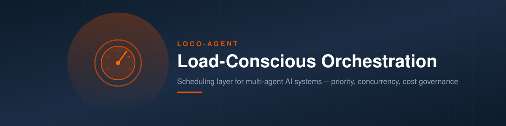
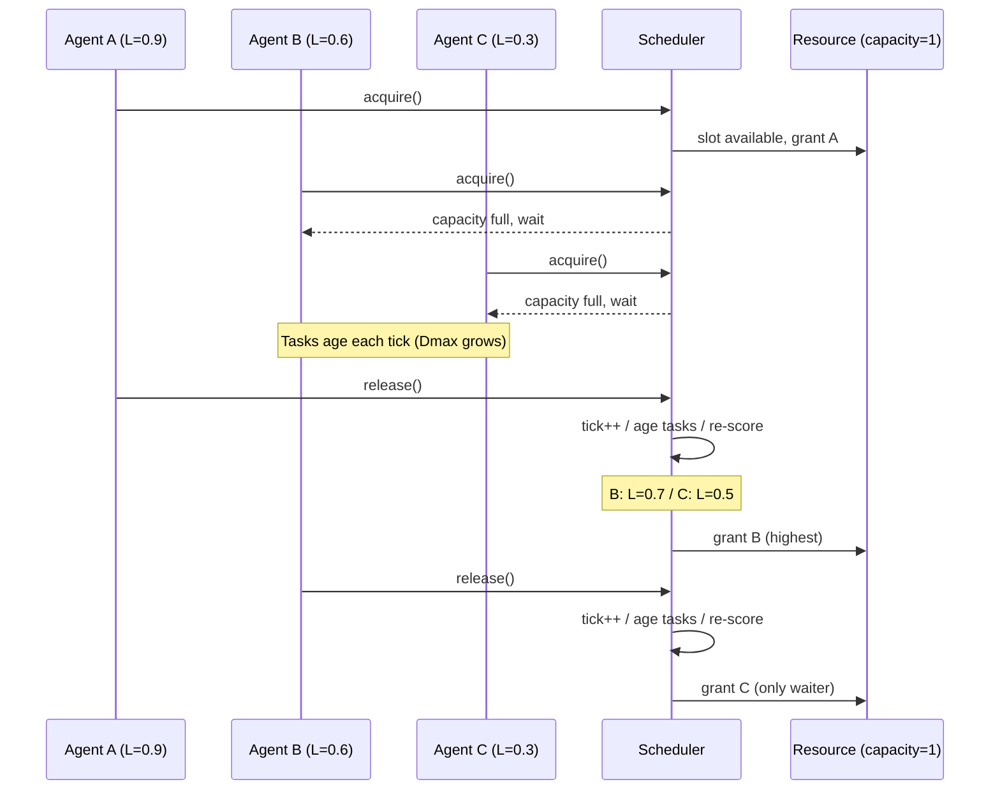
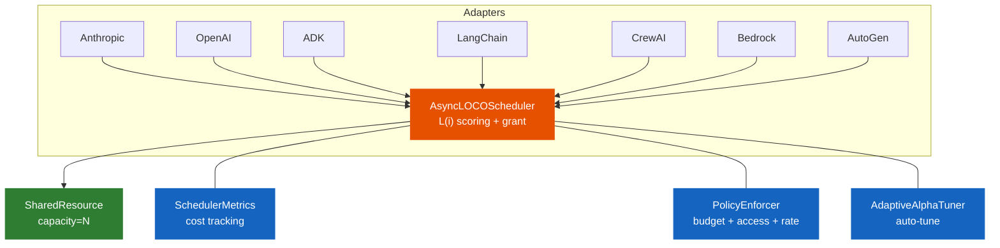

<p align="center">
  
</p>

<p align="center">
  <a href="https://arielsmoliar.github.io/loco-agent/">Docs</a> &middot;
  <a href="#quick-start">Quick Start</a> &middot;
  <a href="https://pypi.org/project/loco-agent/">PyPI</a> &middot;
  <a href="#framework-adapters">Adapters</a> &middot;
  <a href="https://github.com/ArielSmoliar/loco-agent/blob/main/CHANGELOG.md">Changelog</a>
</p>

<p align="center">
  <a href="https://pypi.org/project/loco-agent/"></a>
  <a href="https://pypi.org/project/loco-agent/"></a>
  <a href="https://github.com/ArielSmoliar/loco-agent/blob/main/LICENSE"></a>
  
  
</p>

---

Load-aware scheduling layer for multi-agent AI systems. Sits underneath any Python agent framework and decides which agent gets the shared resource next -- based on queue depth, wait time, and task cost.

Works with LangChain, CrewAI, Google ADK, OpenAI Agents SDK, Anthropic SDK, AWS Bedrock, and Azure/AutoGen.

## Features

- **Load function scheduling** -- one equation ranks all agents: `L(i) = alpha * (Qi / max Qj) + (1 - alpha) * (Dmax_i / max Dmax_j)`
- **No priority rules** -- agents with urgent work escalate automatically via Dmax (wait time)
- **Bounded concurrency** -- `SharedResource(capacity=N)` limits concurrent LLM calls
- **Backpressure** -- `max_waiters` cap prevents unbounded queue growth
- **Cost tracking** -- per-agent token spend visibility across all frameworks
- **Budget management** -- per-agent spend limits with reject / alert / downgrade enforcement modes
- **Policy engine** -- composable PolicyEnforcer with budget, access control, and rate limiting policies
- **Security labels** -- classify task data as public/internal/confidential, enforce at dispatch
- **Execution plans** -- static DAG with topological sort, cycle detection, and dependency tracking
- **SLO error budgets** -- state machine (healthy/warning/critical/exhausted) with rolling window
- **Empirical cost tuning** -- EMA-based weight adjustment from actual token usage
- **Adaptive alpha** -- auto-tunes the latency/throughput tradeoff based on observed wait-time variance
- **7 framework adapters** -- Anthropic, OpenAI, Google ADK, LangChain, CrewAI, AWS Bedrock, Azure/AutoGen
- **Multi-resource** -- deadlock-safe scheduling across multiple resources (LLM + DB + GPU)
- **A2A protocol** -- registers as a first-class agent-to-agent participant
- **Framework-agnostic** -- a LangChain agent and an ADK agent are indistinguishable to the scheduler

## Install

```bash
pip install loco-agent
```

Or from source:

```bash
git clone https://github.com/ArielSmoliar/loco-agent.git
cd loco-agent
pip install -e ".[dev]"
```

Python 3.10+. Zero required dependencies (adapters use optional deps).

## Quick Start

Wrap any async LLM call with `loco.wrap()` -- one line adds scheduling, concurrency control, and cost tracking:

```python
import asyncio
import loco

async def main():
    loco.configure(capacity=3)  # 3 concurrent LLM slots

    # Any async callable -- Anthropic, OpenAI, Gemini, etc.
    async def call_llm(prompt):
        await asyncio.sleep(0.1)  # your LLM call here
        return f"response to: {prompt}"

    # loco.wrap() handles queuing, priority, and cost tracking
    results = await asyncio.gather(
        loco.wrap(call_llm, agent_id="triage",     weight=1.0, prompt="classify this"),
        loco.wrap(call_llm, agent_id="escalation",  weight=3.0, prompt="deep analysis"),
        loco.wrap(call_llm, agent_id="support",      weight=1.0, prompt="draft reply"),
        loco.wrap(call_llm, agent_id="escalation",  weight=3.0, prompt="investigate"),
    )

    scheduler = loco.get_scheduler()
    print(scheduler.metrics.cost_by_agent())

asyncio.run(main())
```

<details>
<summary>Full API example (without convenience wrapper)</summary>

```python
import asyncio
from loco import Agent, Task, AsyncLOCOScheduler, SharedResource

async def main():
    resource = SharedResource("llm_api", capacity=1)
    agents = [Agent(agent_id="urgent"), Agent(agent_id="batch")]
    scheduler = AsyncLOCOScheduler(agents, resource, optimize_for="balanced")

    for _ in range(5):
        await scheduler.submit_task("batch", Task(weight=1.0))
    await scheduler.submit_task("urgent", Task(weight=3.0))

    async def worker(agent_id, n):
        for _ in range(n):
            async with scheduler.acquire(agent_id):
                scheduler.get_agent(agent_id).serve_oldest_task()
                await asyncio.sleep(0)

    await asyncio.gather(worker("urgent", 1), worker("batch", 5))
    print(scheduler.metrics.cost_by_agent())

asyncio.run(main())
```

</details>

## Core Concepts

### The Load Function

```
L(i) = alpha * (Qi / max Qj) + (1 - alpha) * (Dmax_i / max Dmax_j)
```

| Term | What it is |
|------|-----------|
| `Qi` | Weighted queue depth -- sum of `task.weight` in agent i's queue |
| `Dmax_i` | Age of the oldest waiting task (measured in ticks) |
| `alpha` | Tradeoff: 0.0 = latency-first, 0.5 = throughput-first |

Both terms are normalized across all competing agents. Relative load, not absolute.

### Ticks

A tick is one unit of work completed. Each `release()` increments the tick counter and ages all waiting tasks by 1. Under heavy load, ticks fire fast. Under low load, ticks fire slowly. Priority only shifts when there's actual contention.

### Alpha

| Setting | alpha | Behavior | Use when |
|---------|-------|----------|----------|
| `"latency"` | 0.0 | Serve longest-waiting agents first | Webhooks, user-facing requests |
| `"balanced"` | 0.25 | Default | Most workloads |
| `"throughput"` | 0.5 | Serve deepest-backlog agents first | Batch processing, ETL |

Do not use alpha > 0.5. Simulation proves alpha >= 0.75 causes starvation.

### Task Weight

Task weight is a cost proxy set at submit time. The scheduler uses it for queue depth scoring but never interprets it as dollars or tokens -- that's the adapter's job.

| Model tier | Typical weight |
|-----------|---------------|
| haiku / gpt-4o-mini / gemini-flash | 1.0 |
| sonnet / gpt-4o / gemini-pro | 2.0--3.0 |
| opus / o1 | 5.0 |

Adapters compute weight automatically from model name and prompt length. Without an adapter, set weight manually on each `Task`.

### Contention Resolution

When multiple agents call `acquire()` and the resource is full:

1. Agent joins the wait queue
2. On each `release()`, the scheduler re-scores ALL waiters using L(i)
3. Highest score gets the slot -- not FIFO
4. Dmax grows every tick an agent waits, preventing starvation

Scoring happens at grant time, not request time. An agent that arrived late but has high Dmax can win over one that arrived first.



## API Reference

### AsyncLOCOScheduler

```python
from loco import Agent, Task, AsyncLOCOScheduler, SharedResource

scheduler = AsyncLOCOScheduler(
    agents=[ Agent(agent_id="a"), Agent(agent_id="b") ],
    resource=SharedResource("llm_api", capacity=3),
    optimize_for="balanced",   # or "latency" / "throughput"
    max_waiters=100,           # backpressure limit
    seed=42,                   # deterministic tie-breaking
    auto_tune=True,            # adaptive alpha tuning
    on_task_started=callback,  # lifecycle hook
    on_task_completed=callback,
)
```

| Method | Description |
|--------|------------|
| `await submit_task(agent_id, task)` | Enqueue a task. Auto-registers unknown agents. |
| `async with acquire(agent_id, timeout=None)` | Context manager. Blocks until L(i) wins a slot. Auto-releases on exit. |
| `await acquire_start(agent_id, timeout=None)` | Split API. Returns `AcquireHandle`. Use when acquire and release happen in separate callbacks. |
| `await release_handle(handle)` | Release via handle from `acquire_start()`. Safe to call multiple times. |
| `register_agent(agent)` | Register a new agent at runtime. |
| `unregister_agent(agent_id)` | Remove an agent. Raises if holding or waiting. |
| `get_agent(agent_id)` | Get the Agent object. |
| `await shutdown(timeout=30.0)` | Graceful shutdown. Cancels waiters, drains in-flight holders. |

| Property | Type | Description |
|----------|------|------------|
| `agents` | `dict[str, Agent]` | All registered agents |
| `alpha` | `float` | Current alpha value |
| `logical_tick` | `int` | Current tick counter |
| `resource` | `SharedResource` | The shared resource |
| `metrics` | `SchedulerMetrics` | Cost and fairness metrics |

### Task

```python
Task(weight=3.0, task_type="anthropic:opus")
```

| Field | Type | Default | Description |
|-------|------|---------|------------|
| `weight` | `float` | `1.0` | Cost proxy for scheduling |
| `task_type` | `str` | `""` | Label (e.g., `"anthropic:sonnet"`) |
| `age` | `int` | `0` | Ticks waited. Auto-incremented by scheduler. |

### Agent

```python
Agent(agent_id="fraud-detector", agent_type="batch")
```

| Property | Description |
|----------|------------|
| `agent_id` | Unique identifier |
| `agent_type` | Label (e.g., `"webhook"`, `"batch"`) |
| `tasks` | Pending task queue |
| `completed_tasks` | Completed task list |
| `queue_depth_weighted` | Sum of task weights (Qi) |
| `dmax` | Age of oldest task (Dmax_i) |
| `serve_oldest_task()` | Pop and complete the oldest task |

### SharedResource

```python
SharedResource(name="llm_api", capacity=3)
```

| Property | Description |
|----------|------------|
| `capacity` | Max concurrent holders |
| `utilization` | `holder_count / capacity` (0.0 to 1.0) |
| `available_slots` | `capacity - holder_count` |
| `holder_count` | Currently holding agents |
| `waiter_count` | Currently waiting agents |

### SchedulerMetrics

```python
scheduler.metrics.cost_by_agent()
# {"fraud-detector": 847.5, "webhook-handler": 42.0}

scheduler.metrics.total_cost()
# 889.5

scheduler.metrics.agent_cost("fraud-detector")
# 847.5
```

Also: `record_actual_tokens(agent_id, task, tokens)`, `empirical_weight(agent_id)`, `actual_tokens_by_agent()`, `total_actual_tokens()`.

### BudgetManager

```python
from loco.budget import BudgetManager, BudgetExceededError

budget = BudgetManager(default_limit=100.0, on_exceeded="reject")

budget.set_limit("expensive-agent", max_cost=50.0)
budget.check("expensive-agent", task_cost=10.0)  # True
budget.record_spend("expensive-agent", cost=10.0)
budget.remaining("expensive-agent")               # 40.0
budget.spent("expensive-agent")                    # 10.0
budget.summary()                                   # full state dict
budget.reset("expensive-agent")                    # reset spend to 0
budget.reset_all()                                 # reset all agents
```

| Enforcement mode | Behavior |
|-----------------|----------|
| `"reject"` | Raises `BudgetExceededError` |
| `"alert"` | Logs warning, allows the task, records alert |
| `"downgrade"` | Allows the task, flags for model downgrade |

Budget alerts: `budget.alerts` returns a list of all exceeded events.

## Framework Adapters

All adapters follow the same pattern: wrap LLM calls in LOCO scheduling. The developer's agent code does not change.

### Anthropic SDK

```python
from loco.adapters.anthropic import AnthropicAdapter

adapter = AnthropicAdapter(scheduler, client=anthropic.AsyncAnthropic())
response = await adapter.create_message("analyst", model="claude-sonnet-4-20250514", ...)
```

Auto-computes weight from model tier (opus=5, sonnet=2, haiku=1) and prompt length.

### OpenAI Agents SDK

```python
from loco.adapters.openai import OpenAIAdapter

adapter = OpenAIAdapter(scheduler, client=openai.AsyncOpenAI())
response = await adapter.create_chat("assistant", model="gpt-4o", messages=[...])
```

Weight: gpt-4o=3, gpt-4o-mini=1.

### Google ADK

```python
from loco.adapters.google_adk import ADKAdapter

adapter = ADKAdapter(scheduler)
# Wire into ADK agent callbacks:
agent = adk.Agent(
    name="support",
    model="gemini-2.0-flash",
    before_model_callback=adapter.before_model,
    after_model_callback=adapter.after_model,
)
```

Uses split acquire/release across the two callbacks. Weight from Gemini model tier.

### LangChain

```python
from loco.adapters.langchain import LOCOCallbackHandler

callback = LOCOCallbackHandler(scheduler, agent_id="rag-pipeline")
llm = ChatOpenAI(callbacks=[callback])
```

Hooks into `on_llm_start` / `on_llm_end`. Extracts model from serialized config.

### CrewAI

```python
from loco.adapters.crewai import CrewAIAdapter

adapter = CrewAIAdapter(scheduler)
result = await adapter.run_crew(crew, task_descriptions=[...])
```

Per-step scheduling via `step_callback`. Weight by agent role.

### AWS Bedrock

```python
from loco.adapters.aws_bedrock import BedrockAdapter

adapter = BedrockAdapter(scheduler, client=bedrock_client)
response = await adapter.invoke("security-scanner", model_id="anthropic.claude-sonnet-4-20250514-v1:0", body={...})
```

Weight from Bedrock model family (Claude, Llama, Titan).

### Azure / AutoGen

```python
from loco.adapters.autogen import AutoGenAdapter

adapter = AutoGenAdapter(scheduler, default_model="gpt-4o")
result = await adapter.send_message("coordinator", "analyst", "analyze this")
result = await adapter.publish_message("coordinator", "security", content, subscribers=[...])
```

Wraps AutoGen v0.4 message delivery. Weight from Azure OpenAI model tier.

## Cross-Framework Scheduling

All frameworks point to the same scheduler instance:

```python
scheduler = AsyncLOCOScheduler(all_agents, llm_api, optimize_for="balanced")

# LangChain agents: "rag-pipeline", "qa-chain", "summarizer"
# ADK agents: "webhook-handler", "support-bot"
# All 5 compete for the same 3 LLM API slots
```

When ADK webhooks spike, their Dmax grows. The scheduler deprioritizes LangChain batch jobs automatically.

## Examples

```bash
python examples/burst.py           # 8 agents, simultaneous work arrival
python examples/fairness.py        # 10 agents, sustained load, Jain's fairness
python examples/webhook_spike.py   # Background load + urgent webhook spike
python examples/mdash_security.py  # Multi-model cost routing (55 agents)

python sandbox.py --scenario webhook_spike --optimize-for latency
python sandbox.py --scenario burst --agents 10
```

See the [Evaluation Guide](docs/evaluation_guide.md) for copy-paste examples per framework. No API keys needed.

## Architecture



| Public API | What it does |
|-----------|-------------|
| `submit_task(agent_id, task)` | Enqueue task to agent |
| `acquire(agent_id)` | `compute_load_scores()` -> `select_agent()` -> grant or wait |
| `release` (implicit) | tick++ -> age tasks -> re-score waiters -> grant next |
| `shutdown(timeout)` | Cancel waiters, drain in-flight |

## Roadmap

### v0.1 -- Core Scheduler (shipped May 2026)
- Async acquire/release with grant-time scoring, backpressure, cancellation
- 4 validated scenarios, structured JSON logging, metrics API

### v0.2 -- Ecosystem + Cost Visibility (shipped May 2026)
- 7 framework adapters (Anthropic, OpenAI, ADK, LangChain, CrewAI, Bedrock, AutoGen)
- BudgetManager, multi-resource contention, adaptive alpha, A2A protocol
- Convenience API, pretty output, `loco doctor` CLI

### v0.3 -- Cost Governance + Policy Engine (shipped May 2026)
- PolicyEnforcer with composable policies (budget + access + rate)
- BudgetPolicy, AccessPolicy, RatePolicy
- SecurityLabel enum on tasks (public/internal/confidential)
- Static Plan/Step DAG with topological sort and cycle detection
- SLO error budgets (healthy/warning/critical/exhausted state machine)
- 389 tests

### v0.4 -- Enterprise Cost Dashboard (next)
- [ ] Prometheus / OTEL exporter
- [ ] Cost attribution (per-team, per-workflow, per-model)
- [ ] Token-to-outcome tracking
- [ ] Trust scoring (agent behavioral score)
- [ ] Multi-tenant isolation
- [ ] Grafana template

### v0.5+ -- Dynamic Plans, Cross-Provider Routing, LOCO Cloud

See [ROADMAP.md](ROADMAP.md) for the full plan.

## Contributing

```bash
git clone https://github.com/ArielSmoliar/loco-agent.git
cd loco-agent
python3 -m venv .venv && source .venv/bin/activate
pip install -e ".[dev]"
pytest   # 389 tests
```

See [CONTRIBUTING.md](CONTRIBUTING.md) for the full guide.

## License

AGPL-3.0. See [LICENSE](LICENSE).

Enterprise licensing available -- contact [ariel.smoliar@gmail.com](mailto:ariel.smoliar@gmail.com).
