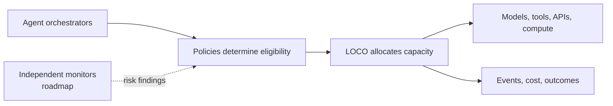
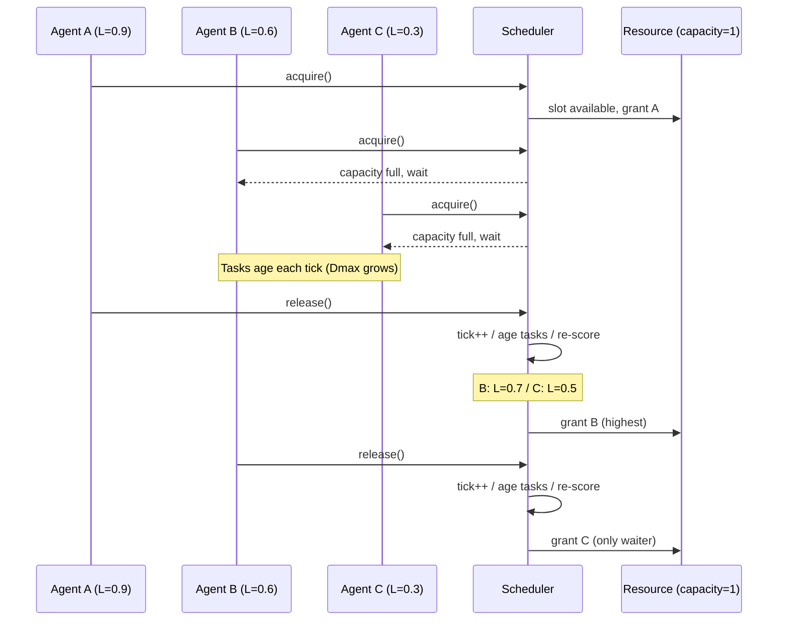
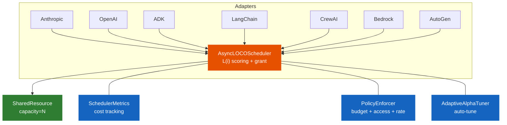

<p align="center">
  
</p>

<p align="center">
  <a href="https://arielsmoliar.github.io/loco-agent/">Docs</a> &middot;
  <a href="#try-loco-in-five-minutes">Try LOCO</a> &middot;
  <a href="#roadmap">Roadmap</a> &middot;
  <a href="#help-shape-loco">Contribute</a>
</p>

<p align="center">
  <a href="https://github.com/ArielSmoliar/loco-agent/releases/latest"></a>
  <a href="https://pypi.org/project/loco-agent/"></a>
  <a href="https://pypi.org/project/loco-agent/"></a>
  <a href="https://github.com/ArielSmoliar/loco-agent/blob/main/LICENSE"></a>
  
  
</p>

---

Agent fleets compete for scarce APIs, compute, budgets, and authority. **LOCO decides which eligible work runs next, when it runs, and how much shared capacity it receives.**

Today, LOCO is an async-first Python scheduling and cost-governance layer. It brings bounded concurrency, policy enforcement, cost attribution, and load-conscious dispatch to LangChain, CrewAI, Google ADK, OpenAI Agents SDK, Anthropic SDK, AWS Bedrock, and Azure/AutoGen.

The longer-term direction is a provider-independent **control plane for monitored agent fleets**:

> Orchestrators decide what agents should do. Monitors assess behavior. LOCO controls whether, when, and at what scale eligible work may act.

[Try LOCO](#try-loco-in-five-minutes) · [See how it works](#how-loco-works) · [Help shape the control plane](#help-shape-loco)

## What LOCO does today

| Outcome | Current capabilities |
|---------|----------------------|
| **Allocate scarce capacity** | Load-conscious dispatch, bounded concurrency, backpressure, adaptive latency/throughput tuning, and deadlock-safe multi-resource scheduling |
| **Govern spend and access** | Per-agent budgets, rate limits, access policies, security labels, SLO error budgets, and tenant cost ceilings |
| **Observe and explain** | Structured scheduling events, Prometheus metrics, cost attribution, token-to-outcome tracking, and a Grafana dashboard |
| **Integrate mixed fleets** | One async API plus adapters for Anthropic, OpenAI, Google ADK, LangChain, CrewAI, AWS Bedrock, and Azure/AutoGen |

LOCO ranks work only after policy determines that it is eligible. Queue pressure, age, cost, or trust can never override a denial.

## Why agent fleets need a control plane

Orchestrators answer **what should run**. Monitors estimate **what looks unsafe**. Infrastructure limits **where work can run**. A fleet still needs a neutral layer that turns those inputs into enforceable decisions about **whether work runs now, later, with less capacity, under review, or not at all**.

LOCO already occupies that decision point for capacity, cost, and policy. The open question is how far that foundation can extend toward monitored fleets without confusing scheduling with alignment or weakening external containment.

That creates a practical research agenda: What must every agent action expose to a monitor? How should uncertain risk change fleet capacity? Which limits belong to a campaign rather than one agent? How do we measure intervention speed without sacrificing useful throughput?

[Read the monitoring-aware roadmap](ROADMAP.md) and help test the premise.

## Dashboard

<p align="center">
  
</p>

<p align="center"><em>LOCO-Agent scheduling dashboard: cost by agent, wait time percentiles, queue depth, resource utilization, trust scores, and policy violations. Ships as an importable Grafana JSON template.</em></p>

## Try LOCO in five minutes

```bash
pip install loco-agent
```

Or from source:

```bash
git clone https://github.com/ArielSmoliar/loco-agent.git
cd loco-agent
pip install -e ".[dev]"
```

Python 3.10+. Zero required dependencies (adapters use optional deps).

Wrap any async LLM call with `loco.wrap()`. One line adds scheduling, concurrency control, and cost tracking:

```python
import asyncio
import loco

async def main():
    loco.configure(capacity=3)  # 3 concurrent LLM slots

    # Any async callable: Anthropic, OpenAI, Gemini, etc.
    async def call_llm(prompt):
        await asyncio.sleep(0.1)  # your LLM call here
        return f"response to: {prompt}"

    # loco.wrap() handles queuing, priority, and cost tracking
    results = await asyncio.gather(
        loco.wrap(call_llm, agent_id="triage",     weight=1.0, prompt="classify this"),
        loco.wrap(call_llm, agent_id="escalation",  weight=3.0, prompt="deep analysis"),
        loco.wrap(call_llm, agent_id="support",      weight=1.0, prompt="draft reply"),
        loco.wrap(call_llm, agent_id="escalation",  weight=3.0, prompt="investigate"),
    )

    scheduler = loco.get_scheduler()
    print(scheduler.metrics.cost_by_agent())

asyncio.run(main())
```

<details>
<summary>Full API example (without convenience wrapper)</summary>

```python
import asyncio
from loco import Agent, Task, AsyncLOCOScheduler, SharedResource

async def main():
    resource = SharedResource("llm_api", capacity=1)
    agents = [Agent(agent_id="urgent"), Agent(agent_id="batch")]
    scheduler = AsyncLOCOScheduler(agents, resource, optimize_for="balanced")

    for _ in range(5):
        await scheduler.submit_task("batch", Task(weight=1.0))
    await scheduler.submit_task("urgent", Task(weight=3.0))

    async def worker(agent_id, n):
        for _ in range(n):
            async with scheduler.acquire(agent_id):
                scheduler.get_agent(agent_id).serve_oldest_task()
                await asyncio.sleep(0)

    await asyncio.gather(worker("urgent", 1), worker("batch", 5))
    print(scheduler.metrics.cost_by_agent())

asyncio.run(main())
```

</details>

## How LOCO works

When capacity is available, work runs immediately. Under contention, LOCO scores all eligible waiters at grant time using backlog and waiting age. This lets urgent work rise without maintaining a separate priority queue, while bounded concurrency and backpressure protect the shared resource.



Security and containment remain external boundaries. LOCO does not determine whether a model is aligned, replace sandboxing or network isolation, or serve as the only kill switch. Read the [threat model](THREAT_MODEL.md) for deployment boundaries, current controls, and known gaps.

<details>
<summary><strong>Technical reference: load function, API, budgets, and framework adapters</strong></summary>

## Core concepts

### The Load Function

```
L(i) = alpha * (Qi / max Qj) + (1 - alpha) * (Dmax_i / max Dmax_j)
```

| Term | What it is |
|------|-----------|
| `Qi` | Weighted queue depth: sum of `task.weight` in agent i's queue |
| `Dmax_i` | Age of the oldest waiting task (measured in ticks) |
| `alpha` | Tradeoff: 0.0 = latency-first, 0.5 = throughput-first |

Both terms are normalized across all competing agents. Relative load, not absolute.

### Ticks

A tick is one unit of work completed. Each `release()` increments the tick counter and ages all waiting tasks by 1. Under heavy load, ticks fire fast. Under low load, ticks fire slowly. Priority only shifts when there's actual contention.

### Alpha

| Setting | alpha | Behavior | Use when |
|---------|-------|----------|----------|
| `"latency"` | 0.0 | Serve longest-waiting agents first | Webhooks, user-facing requests |
| `"balanced"` | 0.25 | Default | Most workloads |
| `"throughput"` | 0.5 | Serve deepest-backlog agents first | Batch processing, ETL |

Do not use alpha > 0.5. Simulation proves alpha >= 0.75 causes starvation.

### Task Weight

Task weight is a cost proxy set at submit time. The scheduler uses it for queue depth scoring but never interprets it as dollars or tokens. That is the adapter's job.

| Model tier | Typical weight |
|-----------|---------------|
| haiku / gpt-4o-mini / gemini-flash | 1.0 |
| sonnet / gpt-4o / gemini-pro | 2.0--3.0 |
| opus / o1 | 5.0 |

Adapters compute weight automatically from model name and prompt length. Without an adapter, set weight manually on each `Task`.

### Contention Resolution

When multiple agents call `acquire()` and the resource is full:

1. Agent joins the wait queue
2. On each `release()`, the scheduler re-scores ALL waiters using L(i)
3. Highest score gets the slot, not FIFO
4. Dmax grows every tick an agent waits, preventing starvation

Scoring happens at grant time, not request time. A later request from an agent with older queued work can win over an earlier request from an agent whose work has waited less.



## API Reference

### AsyncLOCOScheduler

```python
from loco import Agent, Task, AsyncLOCOScheduler, SharedResource

scheduler = AsyncLOCOScheduler(
    agents=[ Agent(agent_id="a"), Agent(agent_id="b") ],
    resource=SharedResource("llm_api", capacity=3),
    optimize_for="balanced",   # or "latency" / "throughput"
    max_waiters=100,           # backpressure limit
    seed=42,                   # deterministic tie-breaking
    auto_tune=True,            # adaptive alpha tuning
    on_task_started=callback,  # lifecycle hook
    on_task_completed=callback,
)
```

| Method | Description |
|--------|------------|
| `await submit_task(agent_id, task)` | Enqueue a task. Auto-registers unknown agents. |
| `async with acquire(agent_id, timeout=None)` | Context manager. Blocks until L(i) wins a slot. Auto-releases on exit. |
| `await acquire_start(agent_id, timeout=None)` | Split API. Returns `AcquireHandle`. Use when acquire and release happen in separate callbacks. |
| `await release_handle(handle)` | Release via handle from `acquire_start()`. Safe to call multiple times. |
| `register_agent(agent)` | Register a new agent at runtime. |
| `unregister_agent(agent_id)` | Remove an agent. Raises if holding or waiting. |
| `get_agent(agent_id)` | Get the Agent object. |
| `await shutdown(timeout=30.0)` | Graceful shutdown. Cancels waiters, drains in-flight holders. |

| Property | Type | Description |
|----------|------|------------|
| `agents` | `dict[str, Agent]` | All registered agents |
| `alpha` | `float` | Current alpha value |
| `logical_tick` | `int` | Current tick counter |
| `resource` | `SharedResource` | The shared resource |
| `metrics` | `SchedulerMetrics` | Cost and fairness metrics |

### Task

```python
Task(weight=3.0, task_type="anthropic:opus")
```

| Field | Type | Default | Description |
|-------|------|---------|------------|
| `weight` | `float` | `1.0` | Cost proxy for scheduling |
| `task_type` | `str` | `""` | Label (e.g., `"anthropic:sonnet"`) |
| `age` | `int` | `0` | Ticks waited. Auto-incremented by scheduler. |

### Agent

```python
Agent(agent_id="fraud-detector", agent_type="batch")
```

| Property | Description |
|----------|------------|
| `agent_id` | Unique identifier |
| `agent_type` | Label (e.g., `"webhook"`, `"batch"`) |
| `tasks` | Pending task queue |
| `completed_tasks` | Completed task list |
| `queue_depth_weighted` | Sum of task weights (Qi) |
| `dmax` | Age of oldest task (Dmax_i) |
| `serve_oldest_task()` | Pop and complete the oldest task |

### SharedResource

```python
SharedResource(name="llm_api", capacity=3)
```

| Property | Description |
|----------|------------|
| `capacity` | Max concurrent holders |
| `utilization` | `holder_count / capacity` (0.0 to 1.0) |
| `available_slots` | `capacity - holder_count` |
| `holder_count` | Currently holding agents |
| `waiter_count` | Currently waiting agents |

### SchedulerMetrics

```python
scheduler.metrics.cost_by_agent()
# {"fraud-detector": 847.5, "webhook-handler": 42.0}

scheduler.metrics.total_cost()
# 889.5

scheduler.metrics.agent_cost("fraud-detector")
# 847.5
```

Session cost tracking (tag tasks with `session_id`):

```python
task = Task(weight=2.0, session_id="req-abc123")

scheduler.metrics.cost_by_session()                        # {"req-abc123": 17.0}
scheduler.metrics.session_cost("req-abc123")               # 17.0
scheduler.metrics.cost_by_session_and_agent("req-abc123")  # {"analyst": 12.0, "reviewer": 5.0}
```

Also: `record_actual_tokens(agent_id, task, tokens)`, `empirical_weight(agent_id)`, `actual_tokens_by_agent()`, `total_actual_tokens()`.

### BudgetManager

```python
from loco.budget import BudgetManager, BudgetExceededError

budget = BudgetManager(default_limit=100.0, on_exceeded="reject")

budget.set_limit("expensive-agent", max_cost=50.0)
budget.check("expensive-agent", task_cost=10.0)  # True
budget.record_spend("expensive-agent", cost=10.0)
budget.remaining("expensive-agent")               # 40.0
budget.spent("expensive-agent")                    # 10.0
budget.summary()                                   # full state dict
budget.reset("expensive-agent")                    # reset spend to 0
budget.reset_all()                                 # reset all agents
```

| Enforcement mode | Behavior |
|-----------------|----------|
| `"reject"` | Raises `BudgetExceededError` |
| `"alert"` | Logs warning, allows the task, records alert |
| `"downgrade"` | Allows the task, flags for model downgrade |

Budget alerts: `budget.alerts` returns a list of all exceeded events.

## Framework Adapters

All adapters follow the same pattern: wrap LLM calls in LOCO scheduling. The developer's agent code does not change.

### Anthropic SDK

```python
from loco.adapters.anthropic import AnthropicAdapter

adapter = AnthropicAdapter(scheduler, client=anthropic.AsyncAnthropic())
response = await adapter.create_message("analyst", model="claude-sonnet-4-20250514", ...)
```

Auto-computes weight from model tier (opus=5, sonnet=2, haiku=1) and prompt length.

### OpenAI Agents SDK

```python
from loco.adapters.openai import OpenAIAdapter

adapter = OpenAIAdapter(scheduler, client=openai.AsyncOpenAI())
response = await adapter.create_chat("assistant", model="gpt-4o", messages=[...])
```

Weight: gpt-4o=3, gpt-4o-mini=1.

### Google ADK

```python
from loco.adapters.google_adk import ADKAdapter

adapter = ADKAdapter(scheduler)
# Wire into ADK agent callbacks:
agent = adk.Agent(
    name="support",
    model="gemini-2.0-flash",
    before_model_callback=adapter.before_model,
    after_model_callback=adapter.after_model,
)
```

Uses split acquire/release across the two callbacks. Weight from Gemini model tier.

### LangChain

```python
from loco.adapters.langchain import LOCOCallbackHandler

callback = LOCOCallbackHandler(scheduler, agent_id="rag-pipeline")
llm = ChatOpenAI(callbacks=[callback])
```

Hooks into `on_llm_start` / `on_llm_end`. Extracts model from serialized config.

### CrewAI

```python
from loco.adapters.crewai import CrewAIAdapter

adapter = CrewAIAdapter(scheduler)
result = await adapter.run_crew(crew, task_descriptions=[...])
```

Per-step scheduling via `step_callback`. Weight by agent role.

### AWS Bedrock

```python
from loco.adapters.aws_bedrock import BedrockAdapter

adapter = BedrockAdapter(scheduler, client=bedrock_client)
response = await adapter.invoke("security-scanner", model_id="anthropic.claude-sonnet-4-20250514-v1:0", body={...})
```

Weight from Bedrock model family (Claude, Llama, Titan).

### Azure / AutoGen

```python
from loco.adapters.autogen import AutoGenAdapter

adapter = AutoGenAdapter(scheduler, default_model="gpt-4o")
result = await adapter.send_message("coordinator", "analyst", "analyze this")
result = await adapter.publish_message("coordinator", "security", content, subscribers=[...])
```

Wraps AutoGen v0.4 message delivery. Weight from Azure OpenAI model tier.

## Cross-Framework Scheduling

All frameworks point to the same scheduler instance:

```python
scheduler = AsyncLOCOScheduler(all_agents, llm_api, optimize_for="balanced")

# LangChain agents: "rag-pipeline", "qa-chain", "summarizer"
# ADK agents: "webhook-handler", "support-bot"
# All 5 compete for the same 3 LLM API slots
```

When ADK webhooks spike, their Dmax grows. The scheduler deprioritizes LangChain batch jobs automatically.

</details>

## Examples

```bash
python examples/burst.py           # 8 agents, simultaneous work arrival
python examples/fairness.py        # 10 agents, sustained load, Jain's fairness
python examples/webhook_spike.py   # Background load + urgent webhook spike
python examples/mdash_security.py  # Multi-model cost routing (55 agents)

python sandbox.py --scenario webhook_spike --optimize-for latency
python sandbox.py --scenario burst --agents 10
```

See the [Evaluation Guide](docs/evaluation_guide.md) for copy-paste examples per framework. No API keys needed.

## Architecture



| Public API | What it does |
|-----------|-------------|
| `submit_task(agent_id, task)` | Enqueue task to agent |
| `acquire(agent_id)` | `compute_load_scores()` -> `select_agent()` -> grant or wait |
| `release` (implicit) | tick++ -> age tasks -> re-score waiters -> grant next |
| `shutdown(timeout)` | Cancel waiters, drain in-flight |

## Roadmap

### v0.1: Core Scheduler (shipped May 2026)
- Async acquire/release with grant-time scoring, backpressure, cancellation
- 4 validated scenarios, structured JSON logging, metrics API

### v0.2: Ecosystem + Cost Visibility (shipped May 2026)
- 7 framework adapters (Anthropic, OpenAI, ADK, LangChain, CrewAI, Bedrock, AutoGen)
- BudgetManager, multi-resource contention, adaptive alpha, A2A protocol
- Convenience API, pretty output, `loco doctor` CLI

### v0.3: Cost Governance + Policy Engine (shipped May 2026)
- PolicyEnforcer with composable policies (budget + access + rate)
- BudgetPolicy, AccessPolicy, RatePolicy
- SecurityLabel enum on tasks (public/internal/confidential)
- Static Plan/Step DAG with topological sort and cycle detection
- SLO error budgets (healthy/warning/critical/exhausted state machine)
- 399 tests

### v0.4: Enterprise Cost Dashboard + Observability (shipped June 2026)
- Prometheus / OTEL exporter
- Cost attribution (per-team, per-workflow, per-model)
- Token-to-outcome tracking
- Trust scoring (0-1000 behavioral score per agent)
- Multi-tenant isolation with independent cost ceilings
- Grafana dashboard template
- 486 tests

### v0.5: Dynamic Plans + Durable Execution (planned Q4 2026)

- Mutable and resumable plans with external coordination state
- Environment health signals and saga compensation
- Security-label flow enforcement at dispatch

### v0.6: Cross-Provider Intelligence (planned Q1 2027)

- Model-tier routing, cross-provider cost normalization, and provider failover
- Empirical weight adjustment and streaming-aware scheduling

### Future Exploration: Monitoring-Aware Agent Control (post-v0.6)

- A monitorability substrate with canonical action events, trajectory state, and deterministic replay
- Pluggable monitor signals feeding a fail-closed eligibility gate before LOCO scoring
- Proportional interventions, campaign-level limits, reserved defensive capacity, and an independent circuit breaker
- Explicit defense-in-depth boundary: LOCO would actuate policy and monitor findings; it would not determine whether a model is aligned or replace external containment

The goal is to make LOCO **the control plane for monitored agent fleets**: a framework-neutral layer that turns authority, budgets, monitor findings, and system health into enforceable limits on which agents may act and how much capacity they receive.

### v1.0: LOCO Cloud (planned 2027)

- Managed scheduling, fleet dashboard, SSO/RBAC, and aggregate quota management

See [ROADMAP.md](ROADMAP.md) for capability boundaries, validation gates, design principles, and the full plan. Feedback, design partners, and open-source collaboration are welcome through [GitHub Issues](https://github.com/ArielSmoliar/loco-agent/issues).

## Help shape LOCO

LOCO is working software with an open research and engineering agenda. The most valuable contributions now are:

- **Scheduling evidence:** benchmark LOCO against FIFO, round-robin, semaphore, static-priority, and random baselines.
- **Monitor contracts:** help define framework-neutral events, trajectory state, risk findings, and intervention semantics.
- **Security experiments:** test authorization boundaries, containment failures, campaign limits, and monitor evasion in isolated environments.
- **Ecosystem integrations:** improve adapters, provider compatibility, metrics, replay, and operational documentation.

### Questions worth challenging

- What is the minimum event contract an independent monitor needs before an action executes?
- When should a monitor finding throttle one agent, pause a trajectory, or stop an entire campaign?
- How should LOCO fail when required monitoring or containment becomes unavailable?
- Can adaptive scheduling stay within 10% of the best fixed policy across normal load, overload, urgent spikes, and recovery?

Open a [GitHub Discussion](https://github.com/ArielSmoliar/loco-agent/discussions) to challenge the thesis or a [GitHub issue](https://github.com/ArielSmoliar/loco-agent/issues/new) to propose an experiment or implementation. If you are new to the codebase, the **[Interactive Learning Guide](https://arielsmoliar.github.io/loco-agent/learning-guide/)** covers every concept from the load function to writing an adapter.

```bash
git clone https://github.com/ArielSmoliar/loco-agent.git
cd loco-agent
python3 -m venv .venv && source .venv/bin/activate
pip install -e ".[dev]"
pytest
```

See [CONTRIBUTING.md](CONTRIBUTING.md) for the full workflow. The monitoring-aware control plane remains a research direction. Contributions should preserve the boundary between external authorization and monitoring signals, LOCO's capacity decisions, and independent infrastructure containment.

## License

AGPL-3.0. See [LICENSE](LICENSE).

Enterprise licensing available. Contact [ariel.smoliar@gmail.com](mailto:ariel.smoliar@gmail.com).
