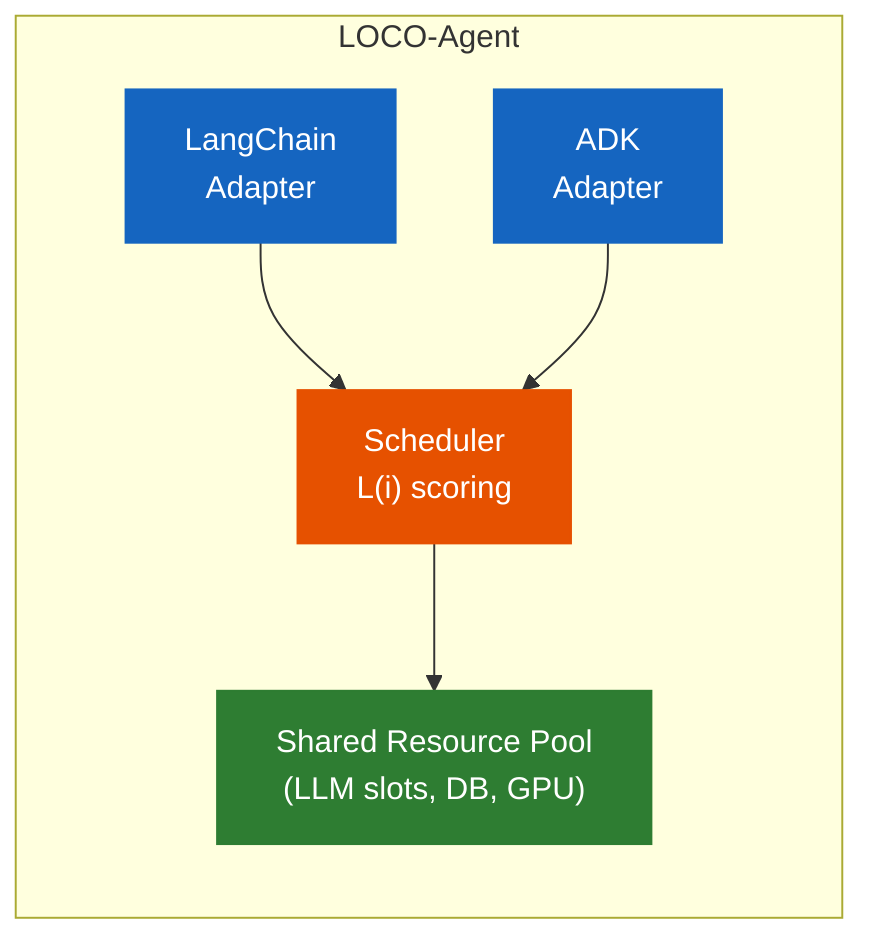
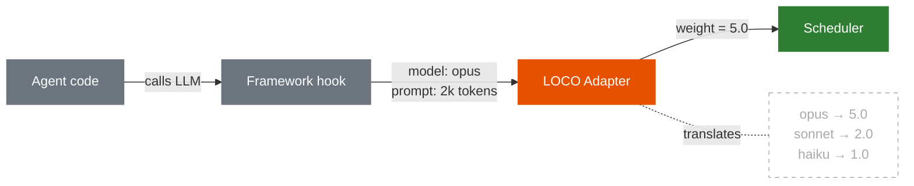
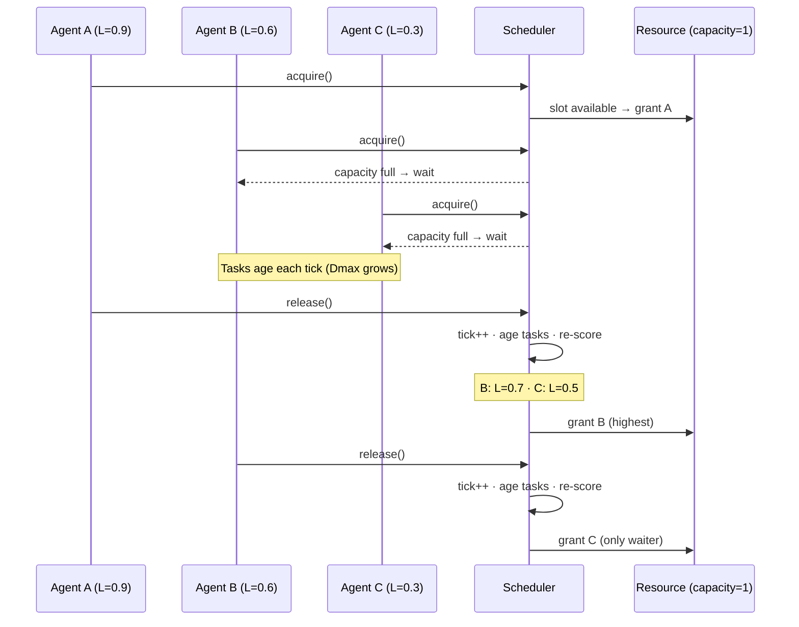
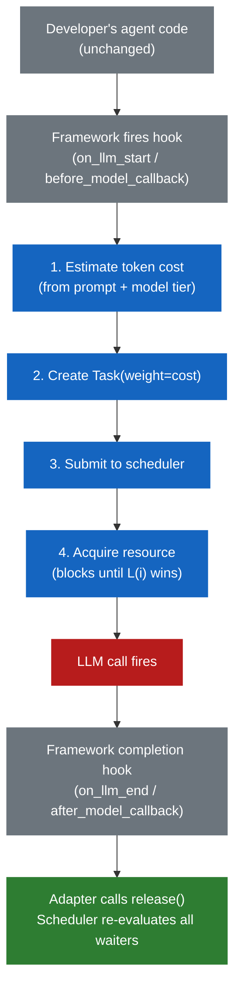

# LOCO-Agent

**Your 50 agents just collided on the same API. The urgent one is stuck behind a batch job. Nobody knows why.**

LOCO-Agent is a load-aware scheduling layer for multi-agent systems. It sits underneath LangGraph, CrewAI, Google ADK, OpenAI Agents SDK, or any Python agent framework and decides which agent gets the shared resource next -- based on queue depth, wait time, and task cost.

- **No priority rules needed** -- agents with urgent work escalate automatically via the load function
- **Proven convergence** -- derived from a wireless networks thesis, validated across 4 production scenarios (254 tests)
- **One equation** -- `L(i) = alpha * (Qi / max Qj) + (1 - alpha) * (Dmax_i / max Dmax_j)`
- **Framework-agnostic** -- register any async function as an agent; schedule across frameworks simultaneously

> AGPL-3.0 -- open core from day one.

## The Problem

Organizations deploying agents at scale hit three problems no framework solves:

1. **No scheduling.** Every framework solves choreography (which agent does what). None solve scheduling (which agent goes *next* when resources are scarce). Your LangChain RAG pipeline and Google ADK webhook handler spike at 2pm and fight over the same LLM API quota blindly. The batch job wins because it got there first. The urgent webhook waits. Your customer notices.

2. **No token visibility.** You're spending $200k/month on LLM inference across dozens of agents. You can't answer "which agents are consuming the most tokens?" or "is high-value work actually getting served first?" Each framework tracks its own calls. Nobody has the cross-agent view.

3. **Manual tuning that never ends.** Every time you add an agent, change a model, or shift traffic patterns, someone has to manually re-tune priorities, rate limits, and routing rules. This is a full-time job that doesn't scale -- and the rules go stale the moment workload patterns shift.

LOCO-Agent solves all three with one layer underneath your existing frameworks.



## Quick Start

### Install

```bash
git clone https://github.com/ArielSmoliar/loco-agent.git
cd loco-agent
python3 -m venv .venv && source .venv/bin/activate
pip install -e ".[dev]"
```

### Try it — 30 seconds

```python
import asyncio
from loco import Agent, Task, AsyncLOCOScheduler, SharedResource

async def main():
    scheduler = AsyncLOCOScheduler(
        [Agent(agent_id="urgent"), Agent(agent_id="batch")],
        SharedResource("llm_api", capacity=1),
        optimize_for="balanced",
    )
    # Batch agent has 5 pending tasks, urgent agent has 1
    for _ in range(5):
        await scheduler.submit_task("batch", Task(weight=1.0))
    await scheduler.submit_task("urgent", Task(weight=3.0))

    async def worker(agent_id, n):
        for _ in range(n):
            async with scheduler.acquire(agent_id):
                scheduler.get_agent(agent_id).serve_oldest_task()
                await asyncio.sleep(0)

    await asyncio.gather(worker("urgent", 1), worker("batch", 5))
    print(f"Cost: {scheduler.metrics.cost_by_agent()}")

asyncio.run(main())
```

### See scheduling in action

```bash
python sandbox.py --scenario webhook_spike --optimize-for latency
python sandbox.py --scenario burst --agents 10
```

### Evaluate with your framework

See the [Evaluation Guide](docs/evaluation_guide.md) — copy-paste examples for Google ADK, Anthropic, OpenAI, AWS Bedrock, Azure/AutoGen, and LangChain. No API keys needed.

### Simulation notebook

```bash
pip install numpy matplotlib jupyter
jupyter notebook simulation/loco_simulation.ipynb
```

### What the notebook shows

The notebook validates the load function across three scenarios:

**Scenario 1 -- Burst:** 8 agents receive work simultaneously. The scheduler serves high-backlog agents first. Service counts match tasks assigned exactly.

**Scenario 2 -- Fairness under sustained load:** 10 agents at different arrival rates for 500 ticks. At alpha=0, Jain's fairness index = 0.995 (near-perfect equity). At alpha >= 0.75, low-load agents starve -- proving the Dmax term is the primary fairness mechanism, not a tie-breaker.

**Scenario 3 -- Webhook spike:** 10 background agents at 70% utilization, then 5 urgent webhooks arrive. Their Dmax grows each tick they wait, naturally crossing over background priority. No rules, no manual assignment -- urgency emerges from the math.

## The Load Function

```
L(i) = alpha * (Qi / max Qj) + (1 - alpha) * (Dmax_i / max Dmax_j)
```

| Term | Meaning |
|------|---------|
| `Qi` | Weighted queue depth -- sum of task costs in agent i's queue |
| `Dmax_i` | Age of the oldest waiting task in agent i's queue (measured in ticks) |
| `alpha` | Tuning knob: 0.0 = latency-optimized, 0.5 = throughput-optimized |

Both terms are **normalized across all competing agents** -- relative priority, not absolute cost. An agent with Q=10 when everyone else has Q=10 scores the same as Q=1 when everyone else has Q=1.

**What's a tick?** A tick is one unit of work completed -- not wall clock time. In the async scheduler, each `release()` increments the tick counter and ages all waiting tasks by 1. Under heavy load, ticks fire fast. Under low load, ticks fire slowly. Priority only shifts when there's actual contention.

### Tuning alpha

| Setting | alpha | Behavior | Use when |
|---------|-------|----------|----------|
| `"latency"` | 0.0 | Prioritize agents whose tasks have waited longest | Webhooks, user-facing requests |
| `"balanced"` | 0.25 | Recommended default | Most workloads |
| `"throughput"` | 0.5 | Prioritize agents with the deepest backlog | Batch processing, ETL |

> **Do not use alpha > 0.5 in production.** The simulation proves that alpha >= 0.75 causes starvation -- some agents complete zero tasks. The Dmax term is load-bearing for fairness.

## What the Scheduler Sees

The scheduler is deliberately decoupled from agent internals. It does not know which model an agent uses, what framework runs it, or how many tokens a call will consume. All of that knowledge is compressed into a single number -- task `weight` -- by the adapter or caller. The scheduler then derives everything it needs from queue state.

### Parameter flow

| Layer | Parameter | What it is | Source |
|-------|-----------|------------|--------|
| **Task** | `weight` | Cost proxy (1=cheap, 3=expensive) | Adapter or caller sets at submit time |
| **Task** | `age` | Ticks spent waiting in queue | Scheduler auto-increments on each release |
| **Agent** | `Qi` | Weighted queue depth = `sum(task.weight)` | Derived from task queue |
| **Agent** | `Dmax` | Oldest waiting task = `max(task.age)` | Derived from task queue |
| **System** | `alpha` | Latency vs throughput tradeoff | Config (`optimize_for`) |
| **System** | `capacity` | Concurrent resource slots | Config (`SharedResource`) |
| **System** | `max_waiters` | Backpressure limit | Config (default 100) |

### What this means

**The scheduler never asks "what are you?"** It asks "how loaded are you?" and "how long have you been waiting?" -- then decides who goes next. This is the key design choice: agent metadata (model, framework, cost profile) is translated into task weight *before* it reaches the scheduler.

**Without an adapter**, the caller must set `weight` manually on each task. The scheduler still works -- it just treats unweighted tasks as `weight=1.0`, losing cost-awareness. You get fair scheduling by queue depth and wait time, but every task looks equally expensive.

**With an adapter**, the translation happens automatically. The adapter intercepts framework hooks (e.g., `on_llm_start`), reads the model name and prompt, computes weight, and submits to the scheduler. The developer's code never changes.



### What the scheduler does NOT know

These are intentionally outside the scheduler's scope in v0.1:

- **Model name or tier** -- abstracted into weight
- **Token budget or spend limit** -- visibility only, not enforcement (planned for v0.2)
- **Per-agent SLA or latency target** -- fairness emerges from Dmax, not from targets
- **Rate limits** -- handled by the resource capacity, not per-agent
- **Framework identity** -- a LangChain agent and an ADK agent are indistinguishable

This separation keeps the scoring function clean: `L(i) = alpha * (Qi / max Qj) + (1 - alpha) * (Dmax_i / max Dmax_j)` works the same whether it's scheduling 3 agents or 300, across one framework or five.

## Token Management

Task weight maps directly to token cost. This gives the scheduler cost-awareness across every agent in the organization, regardless of which framework runs it.

### Cost-aware scheduling

Qi (weighted queue depth) reflects total pending token spend, not just task count. An agent with one GPT-4o call (weight=3) can outprioritize an agent with three Haiku calls (weight=1). The scheduler routes tokens to the work that needs them most.

```python
# Expensive analysis task -- scheduler knows this costs more
await scheduler.submit_task("fraud-detector", Task(weight=3.0, task_type="gpt4o"))

# Cheap triage task -- won't block expensive work unnecessarily
await scheduler.submit_task("ticket-router", Task(weight=1.0, task_type="haiku"))
```

### Cross-agent spend visibility

Every scheduling decision logs the task cost. The metrics API gives the org-level view that no single framework provides:

```python
scheduler.metrics.cost_by_agent()
# {"fraud-detector": 847.5, "webhook-handler": 42.0, "ticket-router": 115.0,
#  "rag-pipeline": 315.0, "summarizer": 203.0}

scheduler.metrics.total_cost()
# 1522.5
```

This answers the questions that matter at scale: which agents are consuming the most tokens? Is high-value work getting served first? Which team's agents are driving spend?

### Self-tuning priority

The load function replaces manual priority rules with math that adapts automatically. When you add a new agent or traffic patterns shift, you don't re-tune anything -- the scheduler re-normalizes across all agents on every scheduling decision. The alpha parameter (`optimize_for`) is the only knob, and it rarely needs to change.

> **v0.1 is visibility only.** Cost tracking and scheduling, not enforcement. Budget ceilings, per-agent spend limits, and model-tier routing are planned for the enterprise tier.

## How It Works

### Step 1: Register agents and a shared resource

At app startup, the platform engineer tells the scheduler which agents exist and what resource they share. Each agent gets its own task queue -- the scheduler reads queue depth and wait time directly from it.

```python
from loco import Agent, Task, AsyncLOCOScheduler, SharedResource

# Define the shared resource (e.g. LLM API with 3 concurrent slots)
llm_api = SharedResource(name="llm_api", capacity=3)

# Register agents -- these are the competitors
agents = [
    Agent(agent_id="rag-pipeline", agent_type="batch"),
    Agent(agent_id="webhook-handler", agent_type="webhook"),
    Agent(agent_id="summarizer", agent_type="batch"),
]

# Create the scheduler -- three words instead of a thesis chapter
scheduler = AsyncLOCOScheduler(agents, llm_api, optimize_for="balanced")
```

### Step 2: Submit tasks as work arrives

When an agent has work to do, submit a task to its queue. The task's weight reflects its cost (1=cheap, 3=expensive).

```python
# A webhook just fired -- submit urgent work
await scheduler.submit_task("webhook-handler", Task(weight=1.0, task_type="webhook"))

# A batch job queued 5 documents for RAG processing
for doc in documents:
    await scheduler.submit_task("rag-pipeline", Task(weight=2.0, task_type="rag"))
```

### Step 3: Acquire the resource, do the work, release

Agents compete for the resource through the load function. The scheduler decides who goes next.

```python
# The agent requests the resource -- blocks until L(i) wins
async with scheduler.acquire("webhook-handler"):
    result = await call_llm(prompt)
# Resource auto-released on exit, scheduler re-evaluates all waiters
```

That's the full lifecycle: register, submit, acquire, release. The scheduler handles priority, fairness, and contention automatically.

### Contention Resolution

When multiple agents call `acquire()` and the resource is full, the scheduler resolves contention through a score-and-grant cycle derived from the [LOCO-MAC protocol](https://en.wikipedia.org/wiki/Contention-based_protocol):



**Key properties:**

- **Scoring happens at grant time, not request time.** An agent that registered late but has high Dmax still wins. This prevents priority inversion.
- **Not FIFO.** The wait queue is re-scored on every release. An agent that joined the queue second can be granted first if its load score is higher.
- **Starvation-proof.** The Dmax term grows every tick an agent waits. Even a low-backlog agent will eventually cross over higher-backlog agents -- urgency emerges from waiting, not from manual priority rules.
- **Backpressure.** If the wait queue exceeds `max_waiters` (default 100), new `acquire()` calls raise `BackpressureError` instead of piling up unboundedly.
- **Guaranteed release.** The `async with` context manager ensures the resource is freed even if the agent raises an exception, preventing deadlock from crashed agents.

## Framework Integration

LOCO-Agent doesn't replace your framework. It wraps the resource calls via framework-specific adapters. The adapter sits between the framework and the scheduler -- the developer's agents run unchanged.



### How the adapter knows the token cost

The adapter estimates cost from information available *before* the LLM call fires. Two approaches:

**Static model tiers** (simplest, good enough for scheduling):

```python
# Platform engineer defines this once
MODEL_COST = {
    "haiku": 1.0,
    "sonnet": 2.0,
    "opus": 5.0,
    "gpt-4o": 3.0,
    "gemini-flash": 1.0,
}
```

**Prompt-based estimate** (more precise):

```python
def estimate_cost(prompts, model="sonnet"):
    tokens = sum(len(p) for p in prompts) // 4   # rough char-to-token
    cost_per_1k = MODEL_COST.get(model, 1.0)
    return tokens * cost_per_1k / 1000
```

The load function normalizes (`Qi / max Qj`), so relative cost is what matters -- not exact dollar amounts. A weight=3 task gets 3x the scheduling weight of a weight=1 task. Being roughly right is enough for correct priority ordering.

> **v0.2 planned:** empirical cost tracking -- after each call completes, record actual token usage and auto-adjust future estimates.

### Using the core API today (v0.1)

The `acquire()` context manager wraps the work — submit, acquire, do work, auto-release:

```python
from loco import Agent, Task, AsyncLOCOScheduler, SharedResource

scheduler = AsyncLOCOScheduler(agents, llm_api, optimize_for="balanced")

# Schedule any async work — the agent blocks until L(i) wins a slot
await scheduler.submit_task("support-bot", Task(weight=2.0))
async with scheduler.acquire("support-bot"):
    response = await call_llm(prompt)  # resource held during this call
# auto-released here — scheduler re-evaluates all waiters
```

This works with any framework. Wrap the LLM call (or agent run) in `acquire()`:

```python
# Google ADK — wrap the runner
await scheduler.submit_task("support-bot", Task(weight=2.0))
async with scheduler.acquire("support-bot"):
    response = await adk_runner.run(user_message)

# LangChain — wrap the chain invoke
await scheduler.submit_task("rag-pipeline", Task(weight=3.0))
async with scheduler.acquire("rag-pipeline"):
    result = await chain.ainvoke({"input": query})

# Anthropic SDK — wrap the API call
await scheduler.submit_task("analyst", Task(weight=5.0))
async with scheduler.acquire("analyst"):
    message = await client.messages.create(model="claude-sonnet-4-20250514", ...)
```

### Per-call framework adapters (shipped)

Frameworks like ADK and LangChain have callback hooks that fire *per LLM call*. The adapters wire into these automatically:

```python
from loco.adapters.google_adk import ADKAdapter
from loco.adapters.langchain import LOCOCallbackHandler

# Google ADK — adapter hooks into before/after model callbacks
adapter = ADKAdapter(scheduler)
agent = adk.Agent(name="support", model="gemini-2.0-flash",
                  before_model_callback=adapter.before_model,
                  after_model_callback=adapter.after_model)

# LangChain — callback handler per agent
callback = LOCOCallbackHandler(scheduler, agent_id="rag-pipeline")
llm = ChatOpenAI(callbacks=[callback])
```

All 7 adapters shipped: Anthropic, OpenAI, Google ADK, LangChain, CrewAI, AWS Bedrock, Azure/AutoGen. See the [Evaluation Guide](docs/evaluation_guide.md) for runnable examples per platform.

### Cross-framework scheduling

The key: both frameworks point to the same scheduler instance.

```python
# One scheduler, one resource pool, all agents compete through L(i)
scheduler = AsyncLOCOScheduler(all_agents, llm_api, optimize_for="balanced")

# LangChain agents registered as "rag-pipeline", "qa-chain", "summarizer"
# ADK agents registered as "webhook-handler", "support-bot", "billing"
# All 6 compete for the same 3 LLM API slots
```

When ADK webhooks spike, their Dmax grows. The scheduler naturally deprioritizes LangChain batch jobs -- no rules, no manual priority.

## Architecture

| Public API (async) | Calls internally |
|--------------------|------------------|
| `acquire(agent_id)` | `compute_load_scores()` → `select_agent()` → grant or wait |
| `release(agent_id)` | tick++ → age tasks → re-score waiters → grant next |
| `submit_task(agent_id, task)` | Enqueue task to agent |
| `shutdown(timeout)` | Cancel waiters, drain in-flight |

The async `acquire()`/`release()` API is the core primitive. The adapter layer wraps this with framework-specific hooks. The scheduler never knows which framework produced the agent. The sync scoring core (`compute_load_scores`, `select_agent`, `_step`) is used internally and exposed for testing.

See [PLAN.md](PLAN.md) for the full build plan, mermaid diagrams, and day-by-day breakdown.

## Origin

The load function is a direct port of the LOCO-MAC contention resolution protocol from a [2011 BGU wireless networks thesis](https://en.wikipedia.org/wiki/Contention-based_protocol). Every MAC primitive has an agent equivalent:

| LOCO-MAC (wireless, 2011) | LOCO-Agent (AI agents, 2026) |
|----------------------------|------------------------------|
| Radio channel | LLM API slot / DB / GPU |
| Node | Agent |
| Queue depth Qi | Weighted task queue |
| Stale delay Dmax | Age of oldest waiting task |
| Contention round | Load-based priority bid |
| End Slave Grant | `release()` signal |

The thesis proved convergence for wireless nodes competing for a shared channel. The simulation proves it works for AI agents competing for shared compute.

## Roadmap

### v0.1.0 (shipped)
- [x] Async scheduler with acquire/release, backpressure, cancellation
- [x] `optimize_for` API, split acquire/release, dynamic agent registration
- [x] Full scenario validation — 4 scenarios, structured JSON logging, metrics API
- [x] Vanilla adapter, testing utilities, sandbox CLI, CI

### v0.2.0 (shipped)
- [x] Anthropic SDK adapter + OpenAI Agents SDK adapter
- [x] LangChain adapter + Google ADK adapter + CrewAI adapter
- [x] AWS Bedrock adapter + Azure / AutoGen adapter
- [x] Empirical cost tracking (EMA-based weight adjustment)
- [x] Adaptive alpha tuning (auto_tune=True)
- [x] Multi-resource contention (deadlock-safe ResourcePool)
- [x] Budget ceilings (per-agent spend limits with enforcement)
- [x] A2A protocol integration (agent card, task submission, status)
- [x] 254 tests passing across 7 platform adapters

See [ROADMAP.md](ROADMAP.md) for the full phased plan.

## Contributing

```bash
git clone https://github.com/ArielSmoliar/loco-agent.git
cd loco-agent
python3 -m venv .venv && source .venv/bin/activate
pip install -e ".[dev]"
pytest                         # 254 tests, all should pass
```

See [CONTRIBUTING.md](CONTRIBUTING.md) for the full guide, or the [Evaluation Guide](docs/evaluation_guide.md) to try LOCO-Agent with your framework in 5 minutes.

## License

AGPL-3.0. See [LICENSE](LICENSE) for details.

Enterprise licensing available -- contact [ariel@loco-agent.dev](mailto:ariel@loco-agent.dev).
