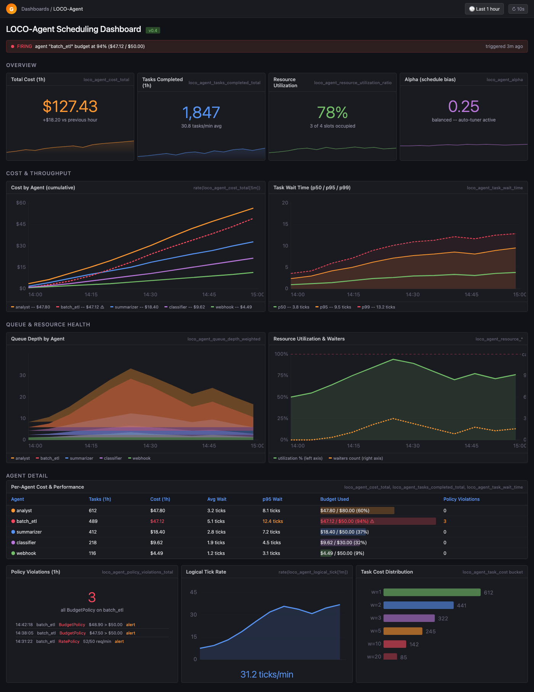

<style>
  .md-main__inner:has(.loco-landing) {
    max-width: none;
    margin: 0;
  }

  .md-main__inner:has(.loco-landing) .md-sidebar {
    display: none;
  }

  .md-main__inner:has(.loco-landing) .md-content,
  .md-main__inner:has(.loco-landing) .md-content__inner {
    max-width: none;
    margin: 0;
    padding: 0;
  }

  .loco-landing {
    --paper: #f7efe3;
    --paper-2: #f0e3d1;
    --ink: #17120d;
    --muted: #655b50;
    --line: rgba(23, 18, 13, 0.18);
    --line-strong: rgba(23, 18, 13, 0.34);
    --ember: #ff5a1f;
    --ember-dark: #d93d13;
    --green: #1ca66a;
    --cyan: #067f8f;
    --blue: #2457d6;
    --panel: rgba(255, 252, 246, 0.76);
    color: var(--ink);
    background:
      linear-gradient(90deg, rgba(23, 18, 13, 0.07) 1px, transparent 1px),
      linear-gradient(rgba(23, 18, 13, 0.07) 1px, transparent 1px),
      radial-gradient(circle at 84% 12%, rgba(255, 90, 31, 0.24), transparent 24rem),
      radial-gradient(circle at 8% 70%, rgba(6, 127, 143, 0.18), transparent 22rem),
      linear-gradient(135deg, var(--paper), var(--paper-2));
    background-size: 28px 28px, 28px 28px, auto, auto, auto;
    overflow: hidden;
  }

  [data-md-color-scheme="slate"] .loco-landing {
    --paper: #11100e;
    --paper-2: #18130f;
    --ink: #fff4e6;
    --muted: #b8aa98;
    --line: rgba(255, 244, 230, 0.15);
    --line-strong: rgba(255, 244, 230, 0.34);
    --panel: rgba(23, 19, 15, 0.82);
    background:
      linear-gradient(90deg, rgba(255, 244, 230, 0.06) 1px, transparent 1px),
      linear-gradient(rgba(255, 244, 230, 0.06) 1px, transparent 1px),
      radial-gradient(circle at 84% 12%, rgba(255, 90, 31, 0.22), transparent 24rem),
      radial-gradient(circle at 8% 70%, rgba(6, 127, 143, 0.22), transparent 22rem),
      linear-gradient(135deg, var(--paper), var(--paper-2));
  }

  .loco-shell {
    width: min(1180px, calc(100% - 2rem));
    margin: 0 auto;
  }

  .loco-topbar {
    min-height: 3.8rem;
    display: flex;
    align-items: center;
    justify-content: space-between;
    gap: 1rem;
    border-bottom: 1px solid var(--line);
    font-size: 0.78rem;
    font-weight: 900;
    letter-spacing: 0.08em;
    text-transform: uppercase;
  }

  .loco-brand {
    display: inline-flex;
    align-items: center;
    gap: 0.55rem;
    color: var(--ink) !important;
    text-decoration: none !important;
  }

  .loco-mark {
    width: 1rem;
    height: 1rem;
    border: 2px solid var(--ink);
    background: var(--ember);
    box-shadow: 0.28rem 0.28rem 0 var(--ink);
  }

  .loco-nav {
    display: flex;
    flex-wrap: wrap;
    justify-content: flex-end;
    gap: 0.8rem;
  }

  .loco-nav a {
    color: var(--muted) !important;
    text-decoration: none !important;
  }

  .loco-nav a:hover {
    color: var(--ember) !important;
  }

  .loco-hero {
    min-height: auto;
    display: grid;
    grid-template-columns: minmax(0, 0.98fr) minmax(360px, 1.02fr);
    gap: clamp(1.5rem, 4vw, 4rem);
    align-items: center;
    padding: clamp(1.5rem, 3vw, 3rem) 0 clamp(0.8rem, 1.8vw, 1.5rem);
  }

  .loco-kicker {
    display: inline-flex;
    align-items: center;
    gap: 0.55rem;
    padding: 0.45rem 0.65rem;
    border: 1px solid var(--line-strong);
    background: rgba(255, 90, 31, 0.12);
    color: var(--ember-dark);
    font-size: 0.72rem;
    font-weight: 950;
    letter-spacing: 0.12em;
    text-transform: uppercase;
  }

  [data-md-color-scheme="slate"] .loco-kicker {
    color: #ffb089;
  }

  .loco-kicker::before {
    content: "";
    width: 0.55rem;
    height: 0.55rem;
    background: var(--green);
    box-shadow: 0 0 0 3px rgba(28, 166, 106, 0.14);
  }

  .loco-landing .loco-title {
    max-width: 11ch;
    margin: 0.9rem 0 0.8rem !important;
    color: var(--ink);
    font-size: clamp(3rem, 5.7vw, 4.8rem);
    font-weight: 1000;
    line-height: 0.88;
    letter-spacing: 0;
  }

  .loco-landing .loco-title span {
    color: var(--ember);
  }

  .loco-landing .loco-lede {
    max-width: 43rem;
    margin: 0 0 1rem !important;
    color: var(--muted);
    font-size: clamp(0.98rem, 1.25vw, 1.08rem);
    line-height: 1.48;
  }

  .loco-actions {
    display: flex;
    flex-wrap: wrap;
    gap: 0.75rem;
    margin: 1rem 0 0.75rem !important;
  }

  .loco-btn {
    display: inline-flex;
    align-items: center;
    justify-content: center;
    min-height: 2.85rem;
    padding: 0.75rem 0.95rem;
    border: 1px solid var(--line-strong);
    color: var(--ink) !important;
    background: var(--panel);
    font-weight: 900;
    text-decoration: none !important;
    box-shadow: 0.22rem 0.22rem 0 rgba(23, 18, 13, 0.18);
    transition: transform 140ms ease, box-shadow 140ms ease, background 140ms ease;
  }

  .loco-btn:hover {
    transform: translate(-2px, -2px);
    box-shadow: 0.35rem 0.35rem 0 rgba(23, 18, 13, 0.22);
  }

  .loco-btn.primary {
    background: var(--ember);
    border-color: var(--ink);
    color: #160c08 !important;
  }

  .loco-installline {
    width: min(37rem, 100%);
    display: grid;
    grid-template-columns: auto 1fr;
    gap: 0.75rem;
    align-items: center;
    margin-top: 0.7rem;
    padding: 0.75rem 0.9rem;
    border: 1px solid var(--line-strong);
    background: rgba(23, 18, 13, 0.08);
    overflow-x: auto;
  }

  [data-md-color-scheme="slate"] .loco-installline {
    background: rgba(255, 244, 230, 0.07);
  }

  .loco-installline b {
    color: var(--green);
    font-size: 0.72rem;
    letter-spacing: 0.12em;
    text-transform: uppercase;
  }

  .loco-installline code {
    color: var(--ink);
    white-space: nowrap;
  }

  .loco-terminal {
    position: relative;
    border: 1px solid var(--line-strong);
    background: #13100d;
    color: #fff4e6;
    box-shadow: 0.7rem 0.7rem 0 rgba(255, 90, 31, 0.22);
    overflow: hidden;
  }

  .loco-terminal::before {
    content: "loco runbook";
    display: block;
    padding: 0.72rem 0.9rem;
    border-bottom: 1px solid rgba(255, 244, 230, 0.18);
    color: #ffb089;
    font-size: 0.72rem;
    font-weight: 950;
    letter-spacing: 0.13em;
    text-transform: uppercase;
  }

  .loco-terminal pre {
    margin: 0 !important;
    padding: 0.78rem 0.9rem !important;
    border-radius: 0 !important;
    background: transparent !important;
    color: #fff4e6 !important;
    font-size: 0.76rem !important;
    line-height: 1.42 !important;
    overflow-x: auto;
  }

  .loco-ledger {
    display: grid;
    grid-template-columns: repeat(4, minmax(0, 1fr));
    border-top: 1px solid rgba(255, 244, 230, 0.18);
    background: rgba(255, 244, 230, 0.06);
  }

  .loco-ledger div {
    min-height: 4.25rem;
    padding: 0.68rem;
    border-right: 1px solid rgba(255, 244, 230, 0.14);
  }

  .loco-ledger div:last-child {
    border-right: 0;
  }

  .loco-ledger strong {
    display: block;
    color: var(--ember);
    font-size: 1.22rem;
    line-height: 1;
  }

  .loco-ledger span {
    display: block;
    margin-top: 0.38rem;
    color: rgba(255, 244, 230, 0.72);
    font-size: 0.68rem;
    line-height: 1.18;
  }

  .loco-strip {
    border-top: 1px solid var(--line);
    border-bottom: 1px solid var(--line);
    background: rgba(255, 255, 255, 0.16);
  }

  [data-md-color-scheme="slate"] .loco-strip {
    background: rgba(255, 244, 230, 0.04);
  }

  .loco-strip .loco-shell {
    display: grid;
    grid-template-columns: repeat(4, minmax(0, 1fr));
    gap: 1px;
    background: var(--line);
  }

  .loco-strip a {
    min-height: 7.3rem;
    padding: 1rem;
    background: var(--panel);
    color: var(--ink) !important;
    text-decoration: none !important;
  }

  .loco-strip strong {
    display: block;
    margin-bottom: 0.48rem;
    color: var(--ink);
  }

  .loco-strip span {
    color: var(--muted);
    font-size: 0.82rem;
    line-height: 1.4;
  }

  .loco-section {
    padding: clamp(3.2rem, 6vw, 6rem) 0;
  }

  .loco-section-head {
    display: flex;
    justify-content: space-between;
    align-items: end;
    gap: 2rem;
    margin-bottom: 1.4rem;
  }

  .loco-section h2 {
    max-width: 14ch;
    margin: 0;
    color: var(--ink);
    font-size: clamp(2.1rem, 5vw, 4.5rem);
    line-height: 0.92;
    letter-spacing: 0;
  }

  .loco-section-head p {
    max-width: 35rem;
    margin: 0;
    color: var(--muted);
    font-size: 1rem;
    line-height: 1.55;
  }

  .loco-positioning {
    max-width: 43rem;
    display: grid;
    grid-template-columns: auto 1fr;
    gap: 0.35rem 0.75rem;
    margin: 1rem 0 0;
    padding: 0.85rem 0;
    border-top: 1px solid var(--line);
    border-bottom: 1px solid var(--line);
  }

  .loco-positioning dt,
  .loco-control-row small,
  .loco-horizon small {
    color: var(--ember-dark);
    font-size: 0.7rem;
    font-weight: 950;
    letter-spacing: 0.12em;
    text-transform: uppercase;
  }

  .loco-positioning dd {
    margin: 0;
    color: var(--ink);
    font-size: 0.84rem;
    font-weight: 750;
  }

  [data-md-color-scheme="slate"] .loco-positioning dt,
  [data-md-color-scheme="slate"] .loco-control-row small,
  [data-md-color-scheme="slate"] .loco-horizon small {
    color: #ffb089;
  }

  .loco-control-loop {
    border: 1px solid var(--line);
    background: var(--panel);
  }

  .loco-control-row {
    display: grid;
    grid-template-columns: 5rem minmax(11rem, 0.7fr) minmax(0, 1.3fr);
    gap: 1.2rem;
    align-items: baseline;
    padding: 1.15rem;
    border-bottom: 1px solid var(--line);
    background: var(--panel);
  }

  .loco-control-row:last-child { border-bottom: 0; }
  .loco-control-row:nth-child(2) {
    margin-left: clamp(0rem, 5vw, 4rem);
    border-left: 4px solid var(--ember);
  }
  .loco-control-row:nth-child(3) { margin-left: clamp(0rem, 10vw, 8rem); }

  .loco-control-row h3 {
    margin: 0;
    color: var(--ink);
    font-size: 1.3rem;
    line-height: 1.08;
  }

  .loco-control-row p,
  .loco-horizon p {
    margin: 0;
    color: var(--muted);
    font-size: 0.9rem;
    line-height: 1.52;
  }

  .loco-horizon {
    display: grid;
    grid-template-columns: 1.05fr 1.3fr 0.85fr;
    gap: 1px;
    border: 1px solid var(--line);
    background: var(--line);
  }

  .loco-horizon > div {
    min-height: 13rem;
    padding: 1.15rem;
    background: var(--panel);
  }

  .loco-horizon > div:nth-child(2) { background: rgba(255, 90, 31, 0.11); }

  .loco-horizon h3 {
    margin: 0.7rem 0 0.55rem;
    color: var(--ink);
    font-size: 1.35rem;
  }

  .loco-contribute {
    padding: clamp(1.4rem, 4vw, 3rem);
    border: 1px solid var(--line-strong);
    background: #17120d;
    color: #fff4e6;
    box-shadow: 0.65rem 0.65rem 0 rgba(6, 127, 143, 0.2);
  }

  .loco-contribute h2 { color: #fff4e6; }
  .loco-contribute p {
    max-width: 45rem;
    color: rgba(255, 244, 230, 0.72);
  }
  .loco-contribute .loco-btn:not(.primary) {
    border-color: rgba(255, 244, 230, 0.4);
    background: rgba(255, 244, 230, 0.08);
    color: #fff4e6 !important;
  }

  .loco-split {
    display: grid;
    grid-template-columns: minmax(0, 0.85fr) minmax(320px, 1.15fr);
    gap: 1px;
    border: 1px solid var(--line);
    background: var(--line);
  }

  .loco-split > div {
    min-width: 0;
    padding: 1.1rem;
    background: var(--panel);
  }

  .loco-split h3 {
    margin: 0 0 0.8rem;
    color: var(--ink);
    font-size: clamp(1.7rem, 3.2vw, 2.8rem);
    line-height: 0.95;
  }

  .loco-split p,
  .loco-split li {
    color: var(--muted);
  }

  .loco-split img {
    display: block;
    width: 100%;
    height: auto;
    border: 1px solid var(--line-strong);
  }

  .loco-matrix {
    display: grid;
    grid-template-columns: repeat(7, minmax(0, 1fr));
    gap: 1px;
    border: 1px solid var(--line);
    background: var(--line);
  }

  .loco-matrix div {
    min-height: 6.5rem;
    display: grid;
    place-items: center;
    padding: 0.8rem;
    background: var(--panel);
    color: var(--ink);
    text-align: center;
    font-weight: 950;
    font-size: 0.82rem;
  }

  .loco-build {
    display: grid;
    grid-template-columns: minmax(0, 0.75fr) minmax(320px, 1.25fr);
    gap: 1px;
    border: 1px solid var(--line);
    background: var(--line);
  }

  .loco-build > div {
    min-width: 0;
    padding: 1.1rem;
    background: var(--panel);
  }

  .loco-build h2 {
    margin-top: 0;
  }

  .loco-build p {
    color: var(--muted);
  }

  .loco-build pre {
    margin: 0 !important;
    min-height: 100%;
    border-radius: 0 !important;
    max-width: 100%;
    overflow-x: auto;
  }

  @media (max-width: 980px) {
    .loco-topbar {
      align-items: flex-start;
      padding: 0.8rem 0;
    }

    .loco-hero,
    .loco-split,
    .loco-build {
      grid-template-columns: 1fr;
    }

    .loco-strip .loco-shell,
    .loco-horizon {
      grid-template-columns: repeat(2, minmax(0, 1fr));
    }

    .loco-horizon > div:last-child { grid-column: 1 / -1; }

    .loco-matrix {
      grid-template-columns: repeat(3, minmax(0, 1fr));
    }

    .loco-section-head {
      display: block;
    }

    .loco-section-head p {
      margin-top: 0.8rem;
    }
  }

  @media (max-width: 640px) {
    .loco-nav {
      display: none;
    }

    .loco-hero {
      min-height: auto;
      padding: 1.15rem 0 0.55rem;
    }

    .loco-landing .loco-title {
      font-size: 2.5rem;
      max-width: 10ch;
      margin: 0.7rem 0 0.6rem !important;
    }

    .loco-landing .loco-lede {
      font-size: 0.98rem;
      line-height: 1.42;
      margin-bottom: 0.8rem !important;
    }

    .loco-actions {
      gap: 0.5rem;
      margin: 0.9rem 0 0.7rem;
    }

    .loco-btn {
      min-height: 2.55rem;
      padding: 0.62rem 0.75rem;
    }

    .loco-terminal {
      display: none;
    }

    .loco-installline {
      grid-template-columns: 1fr;
      gap: 0.35rem;
    }

    .loco-strip .loco-shell,
    .loco-horizon,
    .loco-matrix {
      grid-template-columns: 1fr;
    }

    .loco-horizon > div:last-child { grid-column: auto; }
    .loco-control-row {
      grid-template-columns: 1fr;
      gap: 0.35rem;
    }
    .loco-control-row:nth-child(2),
    .loco-control-row:nth-child(3) { margin-left: 0; }

    .loco-strip a,
    .loco-matrix div {
      min-height: auto;
    }

    .loco-build,
    .loco-build > div {
      overflow: hidden;
    }
  }
</style>

<section class="loco-landing">
  <div class="loco-shell loco-topbar">
    <a class="loco-brand" href="./"><span class="loco-mark"></span>LOCO-Agent</a>
    <nav class="loco-nav" aria-label="Landing navigation">
      <a href="quickstart/">Quick Start</a>
      <a href="#control-plane">How it works</a>
      <a href="#contribute">Contribute</a>
      <a href="https://github.com/ArielSmoliar/loco-agent">GitHub</a>
    </nav>
  </div>

  <div class="loco-shell loco-hero">
    <div>
      <div class="loco-kicker">Open source control for agent fleets</div>
      <h1 class="loco-title">Control the fleet. <span>Not the mind.</span></h1>
      <p class="loco-lede">
        LOCO-Agent is the open-source scheduling and cost-governance layer for AI agents. Control which eligible work runs, when it runs, and how much shared capacity it receives.
      </p>
      <dl class="loco-positioning">
        <dt>Today</dt><dd>A cost firewall with load-conscious scheduling, budgets, attribution, and policy.</dd>
        <dt>Direction</dt><dd>A control plane that turns trusted monitor signals into bounded fleet action.</dd>
      </dl>
      <div class="loco-actions">
        <a class="loco-btn primary" href="quickstart/">Run it in 5 minutes</a>
        <a class="loco-btn" href="https://github.com/ArielSmoliar/loco-agent/discussions/7">Shape the control plane</a>
        <a class="loco-btn" href="https://github.com/ArielSmoliar/loco-agent">Read source</a>
      </div>
      <div class="loco-installline" aria-label="Install command">
        <b>install</b><code>pip install loco-agent</code>
      </div>
    </div>

    <div class="loco-terminal" aria-label="LOCO-Agent control plane terminal preview">
      <pre><code>$ loco doctor
found: anthropic, openai, google-adk, langchain
suggested: shared scheduler with capacity=3

$ LOCO_LOG=pretty python production_agents.py
[ENQUEUE] security     model=opus   team=soc       workflow=incident-review
[GRANT]   security     score=0.91   budget=critical-path remaining
[WAIT]    growth       model=sonnet queue=17.0     reason=capacity
[FLAG]    support      mode=downgrade budget=exceeded
[ATTR]    soc          workflow=incident-review model=opus cost=5.0

$ python - <<'PY'
print(scheduler.metrics.attribution.cost_by_team())
PY
{'soc': 91.0, 'support': 38.0, 'growth': 19.0}</code></pre>
      <div class="loco-ledger">
        <div><strong>7</strong><span>framework adapters</span></div>
        <div><strong>4D</strong><span>team, workflow, model, agent</span></div>
        <div><strong>0</strong><span>required core deps</span></div>
        <div><strong>486</strong><span>tests on GitHub main</span></div>
      </div>
    </div>
  </div>

  <div class="loco-strip">
    <div class="loco-shell">
      <a href="concepts/policies/"><strong>Eligibility first</strong><span>Policy decides what may run before scheduling decides what runs next.</span></a>
      <a href="concepts/budgets/"><strong>Cost firewall</strong><span>Reject, alert, or mark work for downgrade before one agent drains the pool.</span></a>
      <a href="concepts/load-function/"><strong>Load-conscious capacity</strong><span>Urgent work can climb while older jobs keep making progress.</span></a>
      <a href="concepts/prometheus/"><strong>Operational evidence</strong><span>Trace the queue, decision, budget, attribution, and eventual outcome.</span></a>
    </div>
  </div>

  <div class="loco-shell loco-section" id="control-plane">
    <div class="loco-section-head">
      <h2>A control plane turns constraints into action.</h2>
      <p>
        Models reason. Orchestrators plan. Monitors observe. LOCO sits on the execution path, where policy must become a concrete decision about scarce capacity.
      </p>
    </div>

    <div class="loco-control-loop">
      <div class="loco-control-row">
        <small>01 / Admit</small>
        <h3>What is eligible?</h3>
        <p>Apply budgets, tenant boundaries, trust policy, and rate limits before work consumes a shared resource.</p>
      </div>
      <div class="loco-control-row">
        <small>02 / Allocate</small>
        <h3>What runs next?</h3>
        <p>Re-score waiting work as pressure changes, balancing urgency, age, cost, and available capacity.</p>
      </div>
      <div class="loco-control-row">
        <small>03 / Account</small>
        <h3>What happened?</h3>
        <p>Attribute spend and outcomes to the team, workflow, model, session, tenant, and agent that caused them.</p>
      </div>
    </div>
  </div>

  <div class="loco-shell loco-section">
    <div class="loco-section-head">
      <h2>Built now. Researched next. Claimed carefully.</h2>
      <p>LOCO is useful without pretending scheduling solves alignment. The roadmap expands the execution layer only where claims can be tested.</p>
    </div>
    <div class="loco-horizon">
      <div>
        <small>Working today</small>
        <h3>Cost and capacity control</h3>
        <p>Scheduling, budget enforcement, attribution, tenant pools, policies, framework adapters, Prometheus metrics, and Grafana dashboards.</p>
      </div>
      <div>
        <small>Research direction</small>
        <h3>Monitoring-aware fleet action</h3>
        <p>A canonical monitor event contract, campaign-level state, containment policy, audit evidence, and fail-closed behavior when monitoring degrades.</p>
      </div>
      <div>
        <small>Boundary</small>
        <h3>Not an alignment solution</h3>
        <p>LOCO does not understand a model's mind, replace sandboxing or network isolation, or guarantee that a monitor is correct.</p>
      </div>
    </div>
  </div>

  <div class="loco-shell loco-section">
    <div class="loco-split">
      <div>
        <h3>The cost firewall is already working.</h3>
        <p>
          LOCO connects the dispatch decision to the spend story: who waited, which model ran, which budget was touched, and whether the outcome was worth the tokens.
        </p>
        <ul>
          <li>Cost by team, workflow, model, agent, and session</li>
          <li>Token-to-outcome tracking for ROI attribution</li>
          <li>Trust scoring and multi-tenant isolation</li>
          <li>Prometheus metrics plus an importable Grafana dashboard</li>
        </ul>
      </div>
      <div>
        
      </div>
    </div>
  </div>

  <div class="loco-shell loco-section">
    <div class="loco-section-head">
      <h2>One policy layer across the agent zoo.</h2>
      <p>
        Your LangChain batch job, ADK webhook handler, OpenAI assistant, and Anthropic analyst should not each invent their own concurrency, budget, and attribution rules.
      </p>
    </div>
    <div class="loco-matrix" aria-label="Supported adapters">
      <div>Anthropic SDK</div>
      <div>OpenAI SDK</div>
      <div>Google ADK</div>
      <div>LangChain</div>
      <div>CrewAI</div>
      <div>AWS Bedrock</div>
      <div>AutoGen</div>
    </div>
  </div>

  <div class="loco-shell loco-section">
    <div class="loco-build">
      <div>
        <h2>Wrap one call. Keep control.</h2>
        <p>
          Start with `loco.wrap()` around any async LLM call. Add adapters, budgets, tenant pools, policy enforcement, and dashboards as the system grows.
        </p>
        <div class="loco-actions">
          <a class="loco-btn primary" href="quickstart/">Quick Start</a>
          <a class="loco-btn" href="adapters/">Adapters</a>
        </div>
      </div>
      <div>

```python
import asyncio
import loco

async def call_llm(prompt: str):
    return await your_model_client.generate(prompt)

async def main():
    loco.configure(capacity=3, budget_mode="downgrade")
    loco.set_budget("support", max_cost=25.0)

    await loco.wrap(
        call_llm,
        agent_id="support",
        weight=2.0,
        prompt="summarize customer thread",
    )

    attr = loco.get_scheduler().metrics.attribution
    print(attr.cost_by_model())

asyncio.run(main())
```

      </div>
    </div>
  </div>

  <div class="loco-shell loco-section" id="contribute">
    <div class="loco-contribute">
      <div class="loco-kicker">Open questions, open source</div>
      <h2>Help define the missing contract.</h2>
      <p>
        How should independent monitors express risk? What evidence should justify containment? How should a fleet recover without masking starvation or losing useful work? We are turning those questions into benchmarks, interfaces, and falsifiable claims in public.
      </p>
      <div class="loco-actions">
        <a class="loco-btn primary" href="https://github.com/ArielSmoliar/loco-agent/discussions/7">Join the discussion</a>
        <a class="loco-btn" href="https://github.com/ArielSmoliar/loco-agent/issues">Pick an issue</a>
        <a class="loco-btn" href="https://github.com/ArielSmoliar/loco-agent/blob/main/ROADMAP.md">Read the roadmap</a>
        <a class="loco-btn" href="https://github.com/ArielSmoliar/loco-agent/blob/main/THREAT_MODEL.md">Challenge the threat model</a>
      </div>
    </div>
  </div>
</section>
